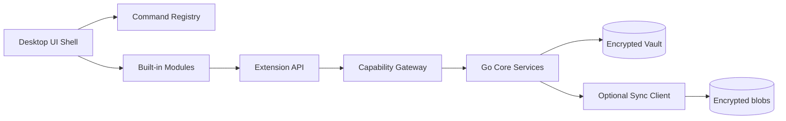

# Sơ đồ hệ thống

DevKit tách UI shell, built-in modules, vault mã hóa, và sync tùy chọn. Mọi truy cập nhạy cảm đi qua biên giới rõ ràng.

## Các lớp chính

1. **UI Shell** — điều hướng, command palette, theme, cửa sổ.
2. **Built-in modules** — vault/notes, connections, tools, plugins host.
3. **Extension API + Capability Gateway** — hợp đồng an toàn cho plugin/MCP.
4. **Go core services** — crypto, storage, SSH/DB adapters, sync client.
5. **Local vault** — dữ liệu mã hóa trên máy.
6. **Optional sync** — upload/download blob đã mã hóa.

## Ranh giới quan trọng

- UI/plugin **không** đọc DEK/Master Password trực tiếp.
- Sync server **không** cần plaintext notes/secrets.
- Hook chỉ notify; hành động phải qua Extension API.

import { Cards, Card } from 'fumadocs-ui/components/card';

<Cards>
  <Card title="Runtime & process" href="/dev-kit/runtime" />
  <Card title="Data & sync" href="/dev-kit/data-sync" />
  <Card title="Security model" href="/dev-kit/security" />
</Cards>
