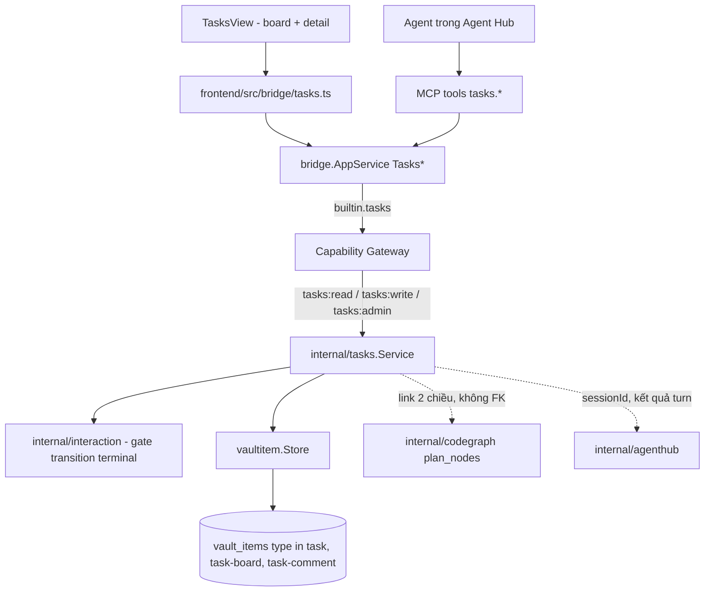
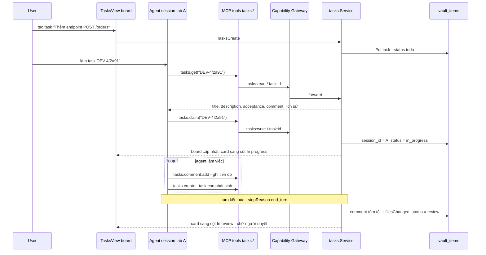
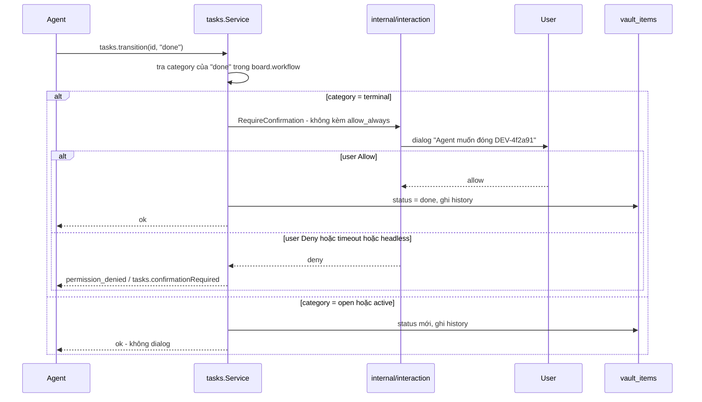
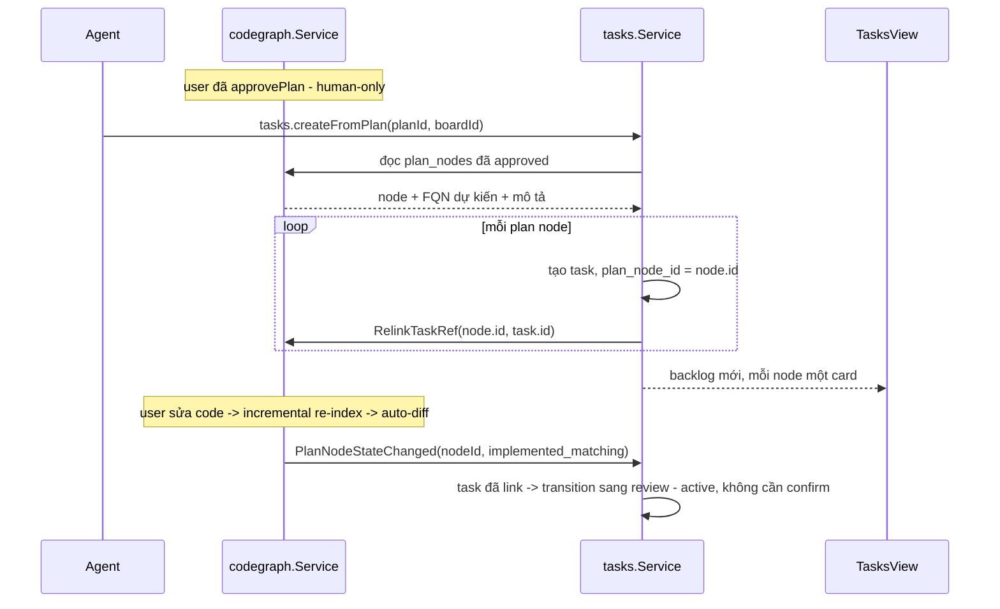

# Tasks

Tasks là built-in module quản lý công việc dạng **board + workflow tuỳ biến**
(kiểu Jira/Linear thu gọn), thiết kế để **agent là actor hạng nhất**: agent
trong [Agent Hub](/dev-kit/agent-hub) tự tạo task, tự nhận (`claim`), tự chuyển
trạng thái và tự comment tiến độ qua MCP — người dùng chỉ còn phải làm hai
việc: **duyệt bước đóng task** và **xoá**. Task lưu trên substrate
`vault_items` chung nên được sync đa thiết bị và mã hoá phần nội dung như mọi
item khác.

import { Callout } from 'fumadocs-ui/components/callout';
import { Cards, Card } from 'fumadocs-ui/components/card';

<Callout type="warn" title="Design only">
Chưa có runtime. Trang này là thiết kế đầy đủ cho module mới; chưa có
`internal/tasks`, chưa có record type `task` trong
`internal/vaultitem/schema.go`. Phụ thuộc: [Agent Hub](/dev-kit/agent-hub)
(Implemented, Claude-only) và [Code Graph § Plan-first flow](/dev-kit/codegraph)
(Design).
</Callout>



Module đăng ký qua `ModuleManifest` như `notes`/`database`/`ssh`/`kafka`/`codegraph`/`agenthub`
hiện có — không tạo registry riêng. Mọi call, từ UI lẫn từ agent qua MCP, đi qua
cùng `AppService.call` + Capability Gateway, không có đường tắt (invariant #1,
[ADR-003](/dev-kit/architecture-decisions#adr-003-capability-gateway-as-sensitive-call-choke-point)).

## BRD — Business requirement

### Vấn đề

Agent Hub đã chạy được nhiều agent song song, và Code Graph đã có plan-first
flow để agent implement theo một flow đã duyệt. Nhưng **không có nơi nào giữ
"việc gì đang làm, ai làm, tới đâu rồi"** ở mức dự án: user phải tự nhớ mình đã
giao gì cho tab nào, agent mất context giữa các phiên thì không có chỗ đọc lại
để biết đã làm tới đâu, và không có cách nào nhìn một màn hình để biết toàn
bộ công việc đang ở trạng thái nào. Dùng Jira/Linear thật thì agent không chạm
được (phải qua network + credential ngoài vault), và thông tin dự án
proprietary rời khỏi máy — trái nguyên tắc local-first.

### Mục tiêu (goals)

- Một board local-first để quản lý công việc, **agent đọc/ghi được trực tiếp
  qua MCP** chứ không phải nhờ người dùng thao tác hộ.
- Agent tự đẩy công việc đi hết vòng đời **tới cửa "chờ duyệt"** — người dùng
  chỉ ra quyết định ở bước cuối, không phải quản lý từng bước trung gian.
- Task **sống lâu hơn phiên agent**: agent mất context / mở phiên mới vẫn đọc
  lại được trạng thái, không cần user thuật lại.
- Nối được với plan-first flow của [Code Graph](/dev-kit/codegraph): plan đã
  duyệt sinh ra backlog, và tiến độ code thật tự phản ánh lên board.
- Không phát minh cơ chế permission/audit/sync riêng — tái dùng nguyên
  Capability Gateway, `internal/interaction` và `vault_items` đã có.

### Actors

| Actor | Nhu cầu |
|---|---|
| Developer dùng DevKit | Nhìn một board biết toàn bộ việc đang ở đâu; giao việc cho agent; duyệt bước cuối |
| Agent trong Agent Hub | Tự nhận việc, ghi tiến độ, đọc lại ngữ cảnh khi mất context, tạo task con khi phát hiện việc phát sinh |
| Agent ngoài (Claude Code/Codex qua MCP) | Cùng quyền như trên, không cần biết mình đang chạy trong hay ngoài Agent Hub |
| Người triển khai module | Biết rõ ranh giới nào agent tự làm được, ranh giới nào bắt buộc con người |

### Functional requirements

| ID | Requirement |
|---|---|
| FR-1 | User tạo được **board** (tên, `key_prefix`, danh sách status tuỳ biến). Nhiều board cùng lúc; task luôn thuộc đúng một board. |
| FR-2 | Mỗi status trong board khai một **`category`** ∈ `open` \| `active` \| `terminal`. Tên status tuỳ ý, nhưng mọi logic (kể cả gate ở FR-8) chỉ dựa vào `category` — xem [Workflow model](#workflow-model--category-mới-là-thứ-logic-dựa-vào). |
| FR-3 | Task có: `title`, `description` (markdown), `status`, `priority`, `labels[]`, `assignee`, `parent_id` (subtask một cấp), `blocked_by[]`. Không có epic/sprint/estimate ở v1. |
| FR-4 | Mỗi task có `key` con người đọc được (vd `DEV-4f2a91`), ổn định suốt vòng đời, dùng làm định danh khi nói chuyện với agent. |
| FR-5 | Agent tạo task được qua MCP (`tasks.create`), kể cả task con của task nó đang làm — không cần user thao tác. |
| FR-6 | Agent **nhận** một task (`tasks.claim`): service ghi `session_id` = phiên agent đang gọi và chuyển task sang status `active` đầu tiên của board. Task đã có `session_id` khác đang sống → reject. |
| FR-7 | Agent chuyển trạng thái task (`tasks.transition`) sang bất kỳ status nào có `category` ∈ `open` \| `active` **không cần xác nhận**. |
| FR-8 | Chuyển sang status `category = terminal` (Done, Won't do, …) qua MCP **bắt buộc** xác nhận tương tác mỗi lần, **không** có `allow_always` — tái dùng `internal/interaction` đã Implemented. |
| FR-9 | `tasks.transition` nhận `expectedStatus` optional; lệch trạng thái hiện tại → reject `validation_failed`, không ghi đè — chống hai agent giẫm chân nhau (xem [Optimistic transition](#optimistic-transition--chống-hai-agent-giẫm-chân)). |
| FR-10 | Agent comment được vào task (`tasks.comment.add`); comment ghi rõ tác giả là `agent:<sessionId>` hay `user`, không trộn lẫn. |
| FR-11 | Mỗi task giữ **lịch sử chuyển trạng thái bounded** (từ → sang, bởi ai, lúc nào), đọc được cả khi phiên agent đã đóng. |
| FR-12 | Khi một turn của agent kết thúc trên task nó đang giữ, service tự post comment tóm tắt (`summary` + `filesChanged` từ [`invokeAgent`](/dev-kit/agent-hub#invokeagent--agent-master-gọi-agent-khác)) và chuyển task sang status `active` cuối cùng của board (thường là *In review*) — **không** tự đóng task. |
| FR-13 | Task link được tới một **plan node** của [Code Graph](/dev-kit/codegraph) (`plan_node_id`) và ngược lại; hai chiều, không copy trạng thái của nhau — xem [Tích hợp Code Graph](#tích-hợp-code-graph--hai-chiều-không-gộp-storage). |
| FR-14 | Tạo hàng loạt task từ một plan **đã được người duyệt** (`tasks.createFromPlan`) — mỗi plan node thành một task, link sẵn. |
| FR-15 | Board view kiểu kanban: cột theo status, kéo-thả card giữa cột; task detail mở trong panel hoặc tab riêng. |
| FR-16 | Xoá task (`tasks:admin`) và mọi thao tác trên board/workflow là **UI-only**, không expose MCP. Task không dùng nữa thì **archive**, không xoá. |

### Non-functional requirements

| ID | Requirement |
|---|---|
| NFR-1 | Mọi call — UI lẫn MCP — đi qua `AppService.call` + Capability Gateway; không có đường tắt cho agent (đúng NFR-3 của [Agent Hub](/dev-kit/agent-hub) và FR-2 của [MCP / Agent](/dev-kit/mcp-agent)). |
| NFR-2 | Mọi write từ agent audit kèm `origin = "mcp"` **và** `session_id` — truy được "agent nào, phiên nào đổi gì", không chỉ "có một agent nào đó". |
| NFR-3 | Không có auto-approve cho transition `terminal`: gate không phản hồi kịp / DevKit chạy headless → **reject** (fail closed), giống NFR-6 của Agent Hub. |
| NFR-4 | `description` và nội dung comment là **payload mã hoá** (envelope V2, AAD binding theo [ADR-005](/dev-kit/architecture-decisions#adr-005-v2-only-envelope-with-aad-binding)); không log plaintext. |
| NFR-5 | `TasksList` bounded: bắt buộc `boardId`, có `limit` + cursor, trả **summary** (không kèm `description`) — detail lấy theo ID. Đúng §4 của [Frontend performance](/dev-kit/frontend-performance). |
| NFR-6 | Board có nhiều task: mỗi cột virtualize riêng (ngưỡng "card/list > 200 item" của Frontend performance), không render cả board bằng DOM tuyến tính. |
| NFR-7 | Transition là **metadata-only write** — không reseal `description`, cùng đường với `NotesSetOrganization`. Agent cập nhật tiến độ không phải giải mã lại nội dung task. |
| NFR-8 | Task sync như mọi `vault_items` record; không có pipeline riêng, không auto-winner khi conflict (xem [Sync & conflict](#sync--conflict)). |
| NFR-9 | Thêm 3 record type mới không được làm vỡ validate của module khác — xem Blast radius ở [Vaultitem contract](#vaultitem-contract). |

### Out of scope (v1)

- **Epic / sprint / iteration / story point / estimate / burndown** — bỏ có chủ
  đích; đây là phần Jira phục vụ quy trình đội người, không phục vụ agent.
- **Transition graph** (luật "từ status X chỉ đi được sang Y") — v1 mọi status
  đi được sang mọi status; ép graph chỉ làm agent kẹt và phải học luật riêng
  của từng board. Chưa có nhu cầu thật thì chưa thiết kế (YAGNI).
- **Multi-user / assignee là người thật khác** — DevKit là app cá nhân;
  `assignee` v1 chỉ là `user` hoặc một `agentType`.
- **Sync board sang Jira/Linear thật** — cần credential + network ngoài vault,
  thuộc một module integration riêng nếu sau này cần.
- **Task template / recurring task / automation rule** kiểu Jira Automation.
- **Trash + purge tự động** — task là bản ghi lịch sử dự án, xoá tự động sau
  N ngày là sai; dùng archive (xem FR-16).

### Acceptance criteria

- Agent trong một tab Agent Hub gọi `tasks.create` → task xuất hiện ngay trên
  board của UI, không cần user refresh.
- Agent gọi `tasks.claim` trên task đang free → task chuyển `in_progress`,
  `session_id` trỏ đúng phiên đó; agent thứ hai claim cùng task → reject rõ ràng.
- Agent gọi `tasks.transition` sang `in_progress`/`review` → chạy thẳng, không
  hiện dialog nào.
- Agent gọi `tasks.transition` sang `done` → **luôn** hiện dialog Allow/Deny,
  kể cả sau khi user đã Allow always cho tool khác; Deny → `permission_denied`,
  task giữ nguyên trạng thái cũ.
- DevKit chạy headless, agent gọi transition sang `done` → fail ngay
  (`tasks.confirmationRequired`), không treo chờ dialog không tồn tại.
- Hai agent cùng gọi `transition(id, "review", expectedStatus: "in_progress")`
  → đúng một cái thành công, cái còn lại `validation_failed`, không có ghi đè
  im lặng.
- Turn của agent kết thúc trên task nó giữ → task tự sang `review` kèm comment
  tóm tắt, **không** tự sang `done`.
- Duyệt một plan ở Code Graph rồi gọi `tasks.createFromPlan` → mỗi plan node
  thành một task đã link sẵn; sửa code đúng FQN → sau incremental re-index,
  task tương ứng tự chuyển sang `review`.
- Vault đang locked → `tasks.get` (cần `description`) trả `vault_locked`
  structured, không phải task rỗng.
- Board có 2.000 task → mở board không có Long Task > 50 ms, DOM bounded.

## Flow

### Agent tự nhận việc và đẩy tới cửa duyệt



Điểm quan trọng: agent **không bao giờ** tự đưa card qua cột cuối. Nó đẩy được
tới đúng cửa, và dừng ở đó.

### Transition terminal — gate của con người



Cơ chế gate là **đúng `internal/interaction` đã Implemented** cho env
confirmation của [Environments](/dev-kit/environments) — khác ở chỗ điều kiện
kích hoạt là `category` của status đích, không phải env tag của profile. Không
thêm cơ chế xác nhận thứ hai vào DevKit.

### Từ plan đã duyệt sang backlog



`tasks.createFromPlan` cho agent gọi được vì plan **đã** qua `approvePlan` của
con người — task sinh ra chỉ là hình chiếu của thứ đã được duyệt, không phải
quyền mới.

## Technical design

### Components

- **`internal/tasks`** (Go, mới) — thin adapter trên `vaultitem.Store` giống
  `internal/notes`: không có bảng/repository/crypto riêng. Giữ workflow
  validation (`category`), optimistic transition, sinh `key`, và gọi
  `internal/interaction` cho transition terminal.
- **`internal/vaultitem`** — substrate dùng chung, thêm 3 record type.
- **`internal/interaction`** — gate xác nhận đã Implemented, dùng lại nguyên.
- **Bridge + MCP adapter** — cùng gọi `tasks.Service`, cùng qua Capability
  Gateway, đúng pattern Notes/Code Graph/Agent Hub.
- **Frontend `frontend/src/modules/tasks/`** — `TasksBoard`, `TaskDetail`,
  `TaskCard`, manifest; bridge adapter `frontend/src/bridge/tasks.ts`.

### Vaultitem contract

Ba record type mới trên `vault_items` ([ADR-008](/dev-kit/architecture-decisions#adr-008-unified-vault_items-store-for-built-in-item-types)):

#### Board — `type = "task-board"`

| Field | At rest | Notes |
|---|---|---|
| `type` | `"task-board"` | Schema-validated |
| `metadata` | `{"name":"DevKit","key_prefix":"DEV","color":"blue","workflow":{...}}` plaintext | `workflow` là danh sách status + `category`, xem dưới |
| `payload` | Envelope V2 rỗng `{}` | `key_id` phải = `task-board` — board không có secret, envelope chỉ để record hợp lệ với sync validation (cùng cách `note-folder` đang làm) |

#### Task — `type = "task"`

| Field | At rest | Notes |
|---|---|---|
| `type` | `"task"` | Schema-validated |
| `metadata` | `{"board_id","key","title","status","priority","labels":[],"assignee","parent_id","blocked_by":[],"plan_node_id","session_id","archived_at","history":[…]}` plaintext | Đủ để render board + filter + sort mà **không** cần decrypt gì |
| `payload` | Envelope V2 của `description` markdown | AAD `(task, <id>, task-body)`; `key_id` phải = `task-body` |
| `history` | tối đa **50** entry `{from,to,by,at}` gần nhất | `by` = `"user"` hoặc `"agent:<sessionId>"` |

`title`/`status` là plaintext metadata — cùng đánh đổi đã chốt cho note title
([ADR-004](/dev-kit/architecture-decisions#adr-004-application-layer-encrypted-records-instead-of-sqlcipher)):
list/filter/board chạy được khi vault locked, chỉ `description` mới cần DEK.

#### Comment — `type = "task-comment"`

| Field | At rest | Notes |
|---|---|---|
| `type` | `"task-comment"` | Schema-validated |
| `metadata` | `{"task_id":"<24hex>","author":"user"\|"agent:<sessionId>","kind":"human"\|"agent"\|"system"}` plaintext | `kind = system` cho comment do service tự post (FR-12) |
| `payload` | Envelope V2 của body markdown | AAD `(task-comment, <id>, task-comment-body)` |

Query comment của một task dùng `ListByTypeAndMetaField("task-comment", "task_id", id)`
— **đúng method đã thiết kế** cho [Notes § Version history](/dev-kit/notes#version-history)
và tái dùng ở [Database § Query history](/dev-kit/database#query-history-và-saved-query),
không thêm cơ chế lookup thứ ba.

<Callout type="warn" title="Blast radius: internal/vaultitem/schema.go">
Thêm **ba** type (`task`, `task-board`, `task-comment`) đụng 2 switch hardcode
dùng chung cho mọi record type — `IsSupportedItemType()` và
`ValidateRecordSchema()` (whitelist `key_id` mong đợi mỗi type). Đây là lần
thêm nhiều type nhất từ trước tới nay trong một module; sửa sai ảnh hưởng
validate của **mọi** module đang dùng `vaultitem`, cần review kỹ hơn hẳn một
thay đổi cục bộ trong `internal/tasks`.
</Callout>

**Vì sao lịch sử transition nằm trong `metadata` chứ không phải type thứ tư:**
history vô nghĩa nếu tách khỏi task (không ai query "mọi transition trong
vault"), nó nhỏ và bounded, và giữ chung một record nghĩa là khi sync về máy
khác thì task và lịch sử của nó **luôn tới cùng lúc**, không có trạng thái
nửa vời. Đổi lại: mỗi transition tạo một version mới của record task, kể cả
khi không đổi gì khác — chấp nhận, vì transition vốn đã là một thay đổi cần
sync.

### Workflow model — `category` mới là thứ logic dựa vào

```json
{
  "statuses": [
    { "id": "todo",        "name": "To do",      "category": "open" },
    { "id": "in_progress", "name": "In progress","category": "active" },
    { "id": "review",      "name": "In review",  "category": "active" },
    { "id": "done",        "name": "Done",       "category": "terminal" },
    { "id": "wont_do",     "name": "Won't do",   "category": "terminal" }
  ]
}
```

- **Không hardcode `"done"` ở bất kỳ đâu trong code.** User đổi tên status,
  thêm `Cancelled`, `Duplicate`, hay dùng board tiếng Việt — gate FR-8 vẫn
  đúng vì nó hỏi `category`, không hỏi tên. Đây là lý do `category` là field
  bắt buộc chứ không phải metadata trang trí.
- **Ràng buộc board:** ít nhất 1 status mỗi category; `category` không sửa
  được sau khi board đã có task ở status đó (đổi `active` → `terminal` sẽ
  hồi tố biến các transition agent đã làm hợp lệ thành lẽ ra phải xin phép).
  Muốn đổi thì tạo status mới và chuyển task sang.
- `active` **cuối cùng** trong danh sách là đích của FR-12 (auto sang review
  khi agent xong turn) — theo thứ tự khai báo, không cần field riêng.

### Task key — sinh từ ID, không dùng counter

`key = <board.key_prefix>-<6 hex đầu của task id>` (vd `DEV-4f2a91`).

Cách Jira làm (counter tăng dần mỗi board) **không dùng được ở đây**: mỗi lần
tạo task phải bump `board.next_seq`, tức mỗi lần tạo task là một write vào
record board. Hai thiết bị (hoặc hai agent offline) cùng tạo task sẽ tạo
conflict trên chính record board — conflict liên tục ở đúng record nóng nhất,
và cần transaction xuyên hai record mà `vaultitem.Store` không có.

Đánh đổi: key không đẹp và không cho biết thứ tự tạo. Chấp nhận — `key` chỉ
để con người và agent gọi tên một task, `created_at` mới là thứ dùng để sắp
xếp.

### Optimistic transition — chống hai agent giẫm chân

Hai agent chạy song song trong cùng một máy **không** tạo sync conflict (cùng
một SQLite local), nên guard phải nằm ở tầng service:

```go
func (s *Service) Transition(ctx context.Context, id, toStatus string, expected *string) (Task, error)
```

- `expected == nil` → ghi đè bình thường (đường của UI: user nhìn thấy trạng
  thái hiện tại trên màn hình rồi mới kéo card).
- `expected != nil` và khác `status` hiện tại → `validation_failed` kèm status
  thật, **không** ghi. Đây là đường **khuyến nghị cho agent**: `tasks.get` trả
  `status` hiện tại, agent truyền lại chính giá trị đó khi transition.
- `tasks.claim` luôn chạy compare-and-set: task đã có `session_id` trỏ tới một
  phiên chưa kết thúc → reject `tasks.alreadyClaimed`, không cướp việc.

### Bridge & capability

Subject luôn `builtin.tasks`. Record ID là 24 lowercase hex (`vaultitem.NewID`),
opaque qua `recordID()` như mọi module khác.

| Method | Capability | Scope | Ghi chú |
|---|---|---|---|
| `TasksBoardList` | `tasks:read` | `board:list` | |
| `TasksBoardCreate` | `tasks:admin` | `board:new` | |
| `TasksBoardUpdate` | `tasks:admin` | `board:<id>` | Gồm sửa workflow |
| `TasksBoardDelete` | `tasks:admin` | `board:<id>` | Reject nếu board còn task chưa archive |
| `TasksList` | `tasks:read` | `task:list` | Bắt buộc `boardId`; `limit` + cursor; trả summary, không kèm `description` |
| `TasksSearch` | `tasks:read` | `task:search` | Title/label/key luôn match; `description` chỉ khi vault unlocked |
| `TasksGet` | `tasks:read` | `task:<id>` | Decrypt `description` |
| `TasksCreate` | `tasks:write` | `task:new` | |
| `TasksUpdate` | `tasks:write` | `task:<id>` | `title` + `description`, **giữ nguyên** status/labels/assignee |
| `TasksSetFields` | `tasks:write` | `task:<id>` | Metadata-only: `priority`, `labels`, `assignee`, `parent_id`, `blocked_by`, `board_id` — không reseal payload |
| `TasksTransition` | `tasks:write` | `task:<id>` | Gate theo `category` (FR-8); nhận `expectedStatus` |
| `TasksClaim` | `tasks:write` | `task:<id>` | Compare-and-set `session_id` |
| `TasksRelease` | `tasks:write` | `task:<id>` | Nhả `session_id`, không đổi status |
| `TasksArchive` / `TasksUnarchive` | `tasks:write` | `task:<id>` | `archived_at`, không purge |
| `TasksDelete` | `tasks:admin` | `task:<id>` | **Hard delete**, cascade comment; UI-only |
| `TasksCommentAdd` | `tasks:write` | `task:<id>` | |
| `TasksCommentList` | `tasks:read` | `task:<id>` | |
| `TasksLinkPlanNode` | `tasks:write` | `task:<id>` | Set/clear `plan_node_id`, đồng bộ ngược sang `plan_nodes` |
| `TasksCreateFromPlan` | `tasks:write` | `task:new` | Chỉ chạy trên plan đã `approved` |

Ba capability tách theo bản chất hành động, cùng lý do đã áp cho
`kafka:connect` / `kafka:produce` / `kafka:admin`:

- **`tasks:read`** — đọc board/task/comment.
- **`tasks:write`** — mọi thay đổi trên **task** (tạo, sửa, transition, claim,
  comment, archive). Đây là capability duy nhất agent cần.
- **`tasks:admin`** — thay đổi **cấu trúc** (board, workflow) và hard delete.
  Tách riêng để có thể cấp `tasks:read` + `tasks:write` cho agent mà không bao
  giờ cấp `tasks:admin`.

Grants thật nằm ở `internal/app/container.go`; `capabilities` trong
`ModuleManifest` chỉ là declaration metadata ([ADR-002](/dev-kit/architecture-decisions#adr-002-internal-modules-before-external-plugins)).

### MCP tool surface

Xem cơ chế chung + rationale ở [MCP / Agent](/dev-kit/mcp-agent).

| MCP tool | Effect | Map sang | Ghi chú |
|---|---|---|---|
| `tasks.board.list` | `read` | `builtin.tasks` / `tasks:read` / `board:list` | Kèm `workflow` để agent biết status nào tồn tại và `category` của nó |
| `tasks.list` | `read` | `builtin.tasks` / `tasks:read` / `task:list` | Summary, filter theo status/assignee/label; không kèm `description` |
| `tasks.search` | `read` | `builtin.tasks` / `tasks:read` / `task:search` | |
| `tasks.get` | `read` | `builtin.tasks` / `tasks:read` / `task:<id>` | Kèm `description`, comment và `history` — đây là nguồn ngữ cảnh agent đọc khi mở phiên mới |
| `tasks.create` | `execute` | `builtin.tasks` / `tasks:write` / `task:new` | |
| `tasks.update` | `execute` | `builtin.tasks` / `tasks:write` / `task:<id>` | title + description |
| `tasks.setFields` | `execute` | `builtin.tasks` / `tasks:write` / `task:<id>` | priority/labels/assignee/parent/blocked_by |
| `tasks.claim` | `execute` | `builtin.tasks` / `tasks:write` / `task:<id>` | Compare-and-set, reject nếu đã có phiên khác giữ |
| `tasks.release` | `execute` | `builtin.tasks` / `tasks:write` / `task:<id>` | |
| `tasks.transition` | `execute` | `builtin.tasks` / `tasks:write` / `task:<id>` | **Gate theo `category`** — `terminal` phải xác nhận mỗi lần, không `allow_always` |
| `tasks.comment.add` | `execute` | `builtin.tasks` / `tasks:write` / `task:<id>` | `author` do service gán, agent **không** tự khai được |
| `tasks.comment.list` | `read` | `builtin.tasks` / `tasks:read` / `task:<id>` | |
| `tasks.archive` | `execute` (`destructiveHint`) | `builtin.tasks` / `tasks:write` / `task:<id>` | Hồi phục được, nên không cần gate |
| `tasks.createFromPlan` | `execute` | `builtin.tasks` / `tasks:write` / `task:new` | Chỉ trên plan đã `approved`; reject plan còn `draft` |

**Không expose qua MCP, bất kể grant** — cùng nhóm hard exclusion đã áp cho
`SetupVault` / `SSHTrustHostKey` / `KafkaConnect` / `CodeGraphApprovePlan`:

- `TasksDelete` — xoá vĩnh viễn, không hồi phục; agent chỉ được `archive`.
- `TasksBoardCreate` / `TasksBoardUpdate` / `TasksBoardDelete` — **đổi
  workflow là đổi chính luật đang ràng buộc agent**. Cho agent sửa `category`
  của một status đồng nghĩa cho nó tự tháo gate FR-8; đây là loại trừ cứng,
  không phải thứ nới ra được bằng cách sửa policy.

`author` của comment và `by` trong `history` **do service gán từ ngữ cảnh
call** (`origin` + `session_id`), không lấy từ tham số tool — agent không tự
khai mình là `user` được.

### Tích hợp Agent Hub

| Điểm nối | Chiều | Cơ chế |
|---|---|---|
| Task ↔ phiên agent | Tasks giữ | `task.session_id`, set bởi `tasks.claim`, clear bởi `tasks.release` hoặc khi phiên chuyển `error`/`done` |
| Kết quả turn → task | Agent Hub → Tasks | Turn kết thúc trên task đang giữ: post comment `kind=system` (`summary`, `filesChanged`) + transition sang `active` cuối (FR-12) |
| Trạng thái phiên → tab task | Agent Hub → Workbench | `agenthub:sessionUpdate` → `setTabStatus(tabOfTask, running\|success\|error)` |
| Task → prompt agent | Tasks → Agent Hub | `tasks.get` là nguồn ngữ cảnh; agent tự đọc, không cần Agent Hub prepend gì |

<Callout type="info" title="Phụ thuộc chưa implement">
Cột "Trạng thái phiên → tab task" dựa vào việc nối `agenthub:sessionUpdate`
vào `setTabStatus` — [Module tabs § Scope](/dev-kit/module-tabs) ghi rõ đây là
**follow-up chưa làm** (`setTabStatus` tồn tại nhưng chưa module nào gọi).
Tasks sẽ là consumer thứ hai của primitive đó, không phải consumer đầu tiên;
nếu Tasks ship trước, board vẫn chạy đủ, chỉ thiếu chấm màu trên tab.
</Callout>

Task **không** chết theo phiên: agent crash / user đóng tab → `session_id`
được clear, task ở nguyên status hiện tại kèm history. Đây chính là lý do
module này tồn tại — [Agent Hub](/dev-kit/agent-hub) lưu session/turn trong
SQLite riêng của nó (derived/operational data, không sync), còn task là **dữ
liệu dự án** nên sống trên `vault_items` và sync đi cùng người dùng.

### Tích hợp Code Graph — hai chiều, không gộp storage

Hai module giữ hai loại sự thật khác nhau, **không copy của nhau**:

| Sự thật | Sở hữu bởi | Nguồn |
|---|---|---|
| Code đã tồn tại chưa, có khớp plan không (`not_implemented` / `implemented_matching` / `implemented_diverged`) | Code Graph | Auto-diff sau incremental re-index — dữ liệu **suy ra từ index**, không ai ghi tay |
| Việc này đang ở bước nào trong quy trình (`todo` / `in_progress` / `review` / `done`) | Tasks | Người hoặc agent chuyển tường minh |

Liên kết là **hai ID trỏ nhau**, không phải foreign key (`plan_nodes` sống
trong SQLite index của Code Graph, `task` sống trong `vault_items` — hai
storage, đúng như backend sync cũng không dùng FK):

```
task.metadata.plan_node_id  ─────►  plan_nodes.id
plan_nodes.task_id          ◄─────  task.id
```

Hai đường tự động chạy qua cầu này:

1. **Plan → backlog** (`tasks.createFromPlan`): plan đã duyệt sinh ra task cho
   từng node, link sẵn cả hai chiều. Biến một flow đã được người duyệt thành
   việc theo dõi được, thay vì để plan nằm im trên canvas.
2. **Code thật → board**: sau mỗi incremental re-index, plan node đổi trạng
   thái ⇒ Tasks transition task đã link:
   - `not_implemented` → `implemented_matching`: task sang **`review`**
     (`category = active` ⇒ không cần xác nhận). **Không** sang `done` —
     "code đã tồn tại và khớp tên" không có nghĩa là "việc đã xong đúng ý".
   - `→ implemented_diverged`: task quay lại `in_progress` + comment
     `kind=system` nêu FQN đang lệch.
   - Task không link plan node thì không có gì tự động xảy ra.

Chiều ngược lại (task → plan) chỉ là **điều hướng**: mở task detail có nút
nhảy tới đúng node trên canvas Code Graph. Tasks không bao giờ ghi vào
`plan_nodes` ngoài field `task_id` của chính liên kết đó.

<Callout type="warn" title="Ranh giới dễ vi phạm">
Cám dỗ lớn nhất là để Tasks đọc `plan_nodes` rồi tự tính lại trạng thái
implement, hoặc để Code Graph hiển thị cột kanban của riêng nó. Cả hai đều tạo
nguồn sự thật thứ hai cho cùng một fact — đúng loại drift đã có sẵn trong bộ
docs này. Nếu cần thêm dữ liệu, thêm field vào **bên đang sở hữu fact đó**,
không nhân bản sang bên kia.
</Callout>

### UI

Module `tasks` với hai view trong cùng workbench pane:

1. **Board** (`tasks.board`, mặc định) — cột theo `workflow.statuses` theo
   đúng thứ tự khai báo; card hiển thị `key`, title, label chip, assignee, và
   một chấm trạng thái phiên nếu task đang được agent giữ. Sidebar trái
   (`useSidebarContent`, xem [Sidebar](/dev-kit/sidebar)) là list board +
   filter.
2. **Detail** (`tasks.detail`) — mở dưới dạng **tab riêng theo task**
   (`openTab({moduleId:"tasks", viewId:"tasks.detail", params:{taskId}, preview:true})`),
   đúng pattern per-item tab mà Notes đã tiêu thụ thật
   ([Module tabs](/dev-kit/module-tabs)). Single-click card = preview tab,
   bắt đầu sửa = pin.

- **Description** dùng lại Plate editor của Notes
  ([ADR-010](/dev-kit/architecture-decisions#adr-010-rich-text-plate-note-editor-not-markdown-only))
  — cùng format markdown ở rest, không thêm editor thứ hai.
- **Nút "New task" + filter** đăng ký vào title bar qua `useModuleAction`
  ([Shell primitives](/dev-kit/shell-primitives)); panel filter đẩy vào
  `SplitPanel`.
- **Mỗi cột virtualize riêng** bằng `VirtualList` (helper opt-in đã thiết kế ở
  [Sidebar § Hiệu năng](/dev-kit/sidebar#hiệu-năng-khi-nội-dung-sidebar-lớn)) —
  board 2.000 task vẫn bounded DOM.

<Callout type="warn" title="Gotcha: kéo-thả giữa hai cột không phải Reorder">
`TabStrip` dùng framer-motion `Reorder` cho kéo-thả — nhưng `Reorder` chỉ sắp
xếp **trong một list**, không có khái niệm thả sang list khác. Board cần
cross-list drag (card đi từ cột To do sang In progress), tức phải có drop
target riêng cho từng cột. Đây là **dependency mới** (`dnd-kit`, hoặc tự viết
pointer + drop zone), không phải "dùng lại `Reorder` như tab" — nhầm chỗ này
sẽ tốn một lượt implement rồi phải làm lại.
</Callout>

### Sync & conflict

Task/board/comment sync như mọi `vault_items` record
(`record_type IN (task, task-board, task-comment)`), không có pipeline riêng —
xem [Data & sync](/dev-kit/data-sync).

| Strategy | Áp dụng cho task |
|---|---|
| `use-ours` / `use-theirs` | Có |
| `merge` | **Không** — `merge` hiện chỉ dành cho `note-body`; task rơi vào `ErrNotMergeable` |

Hệ quả cần biết trước: hai thiết bị cùng chuyển trạng thái một task khi offline
sẽ tạo conflict phải giải quyết tay, dù về mặt nghiệp vụ "cả hai đều chỉ đổi
`status`". Không có auto-winner — đây là quyết định đã chốt ở
[Data & sync](/dev-kit/data-sync), không phải giới hạn riêng của module này.
Cách giảm tần suất trong thực tế: transition là metadata-only write nhỏ và
nhanh, và `session_id` giúp thấy rõ máy nào đang giữ task.

### Error handling

- Toàn bộ lỗi đi qua `internal/apperrors.AppError` (`code`/`message`/`recoverable`)
  — không tạo bộ error code riêng, đúng [Error contract](/dev-kit/technical-contracts#error-contract).
- `tasks.transition` sang status không tồn tại trong board → `validation_failed`
  kèm danh sách status hợp lệ, để agent tự sửa mà không phải đoán.
- `expectedStatus` lệch → `validation_failed` kèm status thật (FR-9).
- `tasks.claim` trên task đã có phiên khác giữ → `tasks.alreadyClaimed`.
- Transition `terminal` bị Deny → `permission_denied`; headless không có UI để
  hiện dialog → `tasks.confirmationRequired` **ngay lập tức**, không chờ
  (cùng hành vi headless đã chốt cho popup chọn cluster của
  [Kafka](/dev-kit/kafka) và [ADR-006](/dev-kit/architecture-decisions#adr-006-loopback-only-server-mode)).
- `tasks.get` khi vault locked → `vault_locked` structured (FR-6 của
  [MCP / Agent](/dev-kit/mcp-agent)), không trả task thiếu `description` ngầm.
- `tasks.createFromPlan` trên plan còn `draft` → `validation_failed`, không
  tạo task nào (all-or-nothing, không tạo nửa chừng).

## Known ceiling (v1)

- Không có epic/sprint/estimate — board này quản lý **việc**, không quản lý
  **kế hoạch theo thời gian**.
- Không có transition graph: agent chuyển từ `todo` thẳng sang `review` là
  hợp lệ. Nếu cần siết thì đó là thiết kế v2.
- Subtask **một cấp** (`parent_id`), không cây nhiều tầng — cùng giới hạn đã
  áp cho folder của [Notes](/dev-kit/notes).
- `blocked_by` chỉ để hiển thị và cho agent đọc; **không** chặn transition —
  DevKit không tự quyết định thay người dùng rằng một việc chưa được làm.
- Conflict trên task chỉ ours/theirs, không merge field-level (xem trên).
- `key` không phản ánh thứ tự tạo (xem [Task key](#task-key--sinh-từ-id-không-dùng-counter)).
- Lịch sử transition bounded 50 entry/task, chưa cấu hình được.
- Auto-transition từ Code Graph chỉ chạy cho task **đã link** plan node; task
  thường không có gì tự động.
- Chấm trạng thái phiên trên tab task phụ thuộc follow-up
  `agenthub:sessionUpdate` → `setTabStatus` chưa implement.

## Open questions

- Transition sang `terminal` hiện yêu cầu xác nhận **mỗi lần**. Với board mà
  agent đóng hàng chục task nhỏ, có nên có `allow_always` **theo board**
  (không phải theo tool) không, hay giữ nguyên vì đó chính là điểm kiểm soát
  duy nhất còn lại?
- Metadata-only write (transition, `setFields`) về mặt kỹ thuật **không cần
  DEK**. V1 vẫn gate toàn module sau vault unlocked cho nhất quán với mọi
  module khác — có nên mở cho agent cập nhật tiến độ khi vault đang locked
  không, hay tính nhất quán quan trọng hơn?
- Khi phiên agent chết giữa chừng, task nên tự `release` ngay hay giữ
  `session_id` thêm một khoảng để agent reconnect lại đúng việc?
- `assignee` v1 là `user` hoặc `agentType`. Có cần gán tới đúng **một session
  đang chạy** (khác `session_id` do `claim` set) không, hay hai khái niệm đó
  nên gộp làm một?
- Comment `kind=system` do service tự post có nên đếm vào cùng danh sách với
  comment người/agent không, hay tách thành một tab "Activity" riêng trong
  task detail?

<Cards>
  <Card title="Agent Hub" href="/dev-kit/agent-hub" description="Nguồn actor chính — agent claim task, kết quả turn đẩy task sang review" />
  <Card title="Code Graph" href="/dev-kit/codegraph" description="Plan-first flow — plan đã duyệt sinh backlog, auto-diff đẩy task sang review" />
  <Card title="Vault" href="/dev-kit/vault" description="Substrate vaultitem mà task/board/comment adapter vào" />
  <Card title="MCP / Agent" href="/dev-kit/mcp-agent" description="Cơ chế tool surface + confirmation gate được tái dùng nguyên" />
  <Card title="Module tabs" href="/dev-kit/module-tabs" description="Per-item tab cho task detail + setTabStatus theo phiên agent" />
  <Card title="Data & sync" href="/dev-kit/data-sync" description="Task sync như mọi vault_items record, conflict ours/theirs" />
</Cards>
