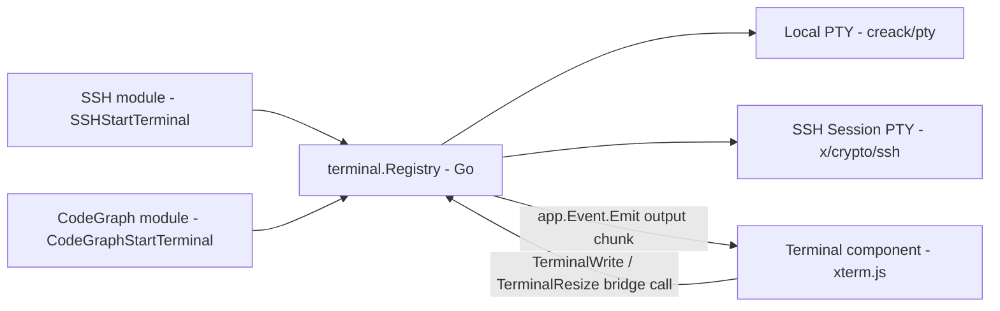
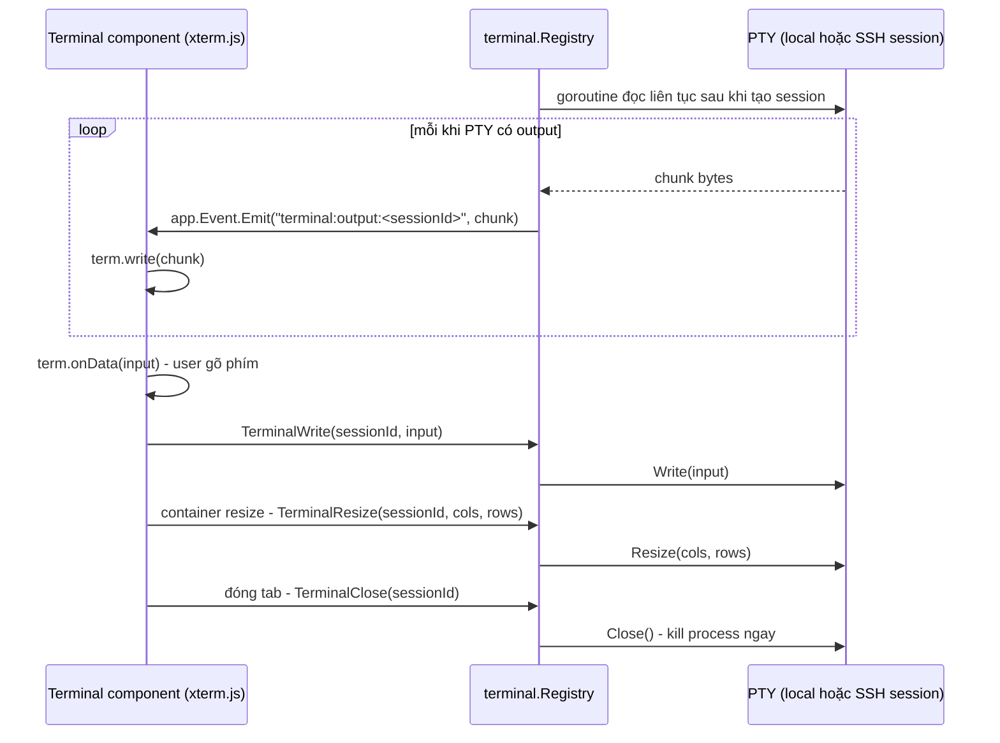

# Terminal

Primitive terminal tương tác dùng chung, dựng trên **xterm.js** (frontend) +
**PTY session registry** ở Go (`internal/terminal`, mới). Khác
[Code editor](/dev-kit/code-editor) — primitive đó chỉ chia sẻ ở tầng
frontend (consumer tự mang extension); Terminal chia sẻ **cả 2 tầng**, vì cả
2 consumer đều cần backend thật quản lý process/PTY, không chỉ config.
Primitive không biết session đang chạy **local** (CodeGraph) hay **qua SSH**
(SSH module) — cả hai cùng implement 1 interface `PTY` phía Go.

import { Callout } from 'fumadocs-ui/components/callout';
import { Cards, Card } from 'fumadocs-ui/components/card';

<Callout type="warn" title="Design only">
Chưa có runtime. Consumer đầu tiên:
[SSH § Terminal tương tác (PTY)](/dev-kit/ssh#terminal-tương-tác-pty);
consumer thứ 2:
[Code Graph § Terminal cục bộ](/dev-kit/codegraph#terminal-cục-bộ-buildtestrun-project).
</Callout>

## Backend: `internal/terminal` — 1 interface, 2 implementation

Interface `PTY` chỉ có 4 method: `Read`, `Write`, `Resize(h, w)`, `Close`.

- **Local** (`creack/pty`, dependency Go mới) — `pty.StartWithSize(cmd, ws)`
  trả `*os.File` (đọc/ghi trực tiếp), `pty.Setsize(f, ws)` cho resize. Dùng
  cho [Code Graph § Terminal cục bộ](/dev-kit/codegraph#terminal-cục-bộ-buildtestrun-project).
- **Remote** (`golang.org/x/crypto/ssh`, **đã** là dependency của
  [SSH](/dev-kit/ssh), không cần thêm) — `Session.RequestPty(term, h, w, modes)`
  + `Session.Shell()` mở PTY phía server; `Session.WindowChange(h, w)` cho
  resize; `Session.StdinPipe()`/`Session.StdoutPipe()` làm `Read`/`Write`.
  Dùng cho [SSH § Terminal tương tác](/dev-kit/ssh#terminal-tương-tác-pty).
- **`Registry`** map `sessionID → PTY`, dùng chung cho cả 2 nguồn — consumer
  chỉ cần tạo `PTY` đúng loại rồi đăng ký, phần còn lại (I/O loop, bridge
  method, event) chạy chung 1 đường.

## Transport: Wails Events (output) + bridge call (input/resize)

Wails v3 `Events` chỉ 1 chiều Go → JS — chiều JS → Go vẫn qua bridge method
thường (`AppService.call`), không phải Events:

- **Output**: goroutine riêng đọc `PTY.Read` liên tục, mỗi chunk emit qua
  `app.Event.Emit("terminal:output:<sessionId>", chunk)` — frontend
  `Events.On` tương ứng, gọi thẳng `term.write(chunk)`.
- **Input**: `term.onData(cb)` (xterm.js) — mỗi keystroke gọi
  `TerminalWrite(sessionId, data)` qua bridge, **không** qua Events.
- **Resize**: `@xterm/addon-fit`'s `fit()` tính lại cols/rows theo kích
  thước container, gọi `TerminalResize(sessionId, cols, rows)` — Go route
  xuống đúng implementation (`pty.Setsize` hoặc `Session.WindowChange`) tuỳ
  session là local hay remote, primitive/consumer không cần biết khác biệt
  này.

## Capability: `terminal:io`, tách khỏi capability tạo session

`TerminalWrite`/`TerminalResize`/`TerminalClose` dùng chung 1 capability mới
`terminal:io`, scope `session:<id>` — **không** dùng lại `ssh:connect` hay
`codegraph:terminal` cho 3 method này, vì chúng thao tác trên session đã tồn
tại, không phải hành động gốc (dial SSH / mở terminal). Việc **tạo** session
(`SSHStartTerminal`, `CodeGraphStartTerminal`) vẫn gate bởi capability của
module sở hữu (`ssh:connect`, `codegraph:terminal`) như bình thường — sau khi tạo
xong, `sessionId` mới là thứ được cấp quyền `terminal:io`, không phải ai gọi
`TerminalWrite` với ID đúng cũng qua được (Gateway verify session đó thuộc
đúng subject đã tạo ra nó).

## Lifecycle: kill ngay khi đóng tab

Đóng tab terminal (dù SSH session hay local shell) → `TerminalClose` → `PTY.Close()`
— kill process ngay, không giữ chạy nền. Khác Agent Hub (session agent giữ
chạy khi chuyển tab) — terminal ở đây là **user tự tay gõ lệnh**, đóng tab
đồng nghĩa kết thúc phiên làm việc đó, khớp kỳ vọng terminal thật (VS Code,
iTerm) chứ không phải long-running background job.

## Bảo mật: local shell không qua `internal/sandbox`

Terminal cục bộ (CodeGraph) chạy **trực tiếp**, không bọc qua
`internal/sandbox` (bubblewrap/Seatbelt) — khác agent CLI subprocess luôn bị
cách ly. Lý do: `internal/sandbox` cách ly tiến trình DevKit **tự spawn thay
mặt agent không tin tưởng**; terminal tương tác là **user tự tay gõ từng
lệnh**, bản chất khác hẳn — bọc sandbox vào đây chỉ gây vướng (thiếu quyền
mount/`sudo` mà user vốn dùng bình thường trên máy mình) mà không thêm an
toàn thật, vì mọi lệnh đều do chính user chủ động chạy.

## Consumers

- **SSH § Terminal tương tác (PTY)** — remote shell qua SSH session đã
  auth/trust host-key. Xem [SSH](/dev-kit/ssh#terminal-tương-tác-pty).
- **Code Graph § Terminal cục bộ** — shell tại `cwd` = project root đang mở,
  chạy build/test/run (`mvn`, `./gradlew`, ...). Xem
  [Code Graph](/dev-kit/codegraph#terminal-cục-bộ-buildtestrun-project).

## Non-goals

- MCP tool surface — terminal tương tác **human-only**, agent vẫn dùng
  `ssh.runCommand` one-shot đã có (bounded, có policy env tag) thay vì 1
  session tương tác riêng cho agent — rủi ro cao hơn hẳn one-shot, không cần
  thiết ở v1.
- Session sống ngoài vòng đời tab — đóng tab luôn kill process, không có
  khái niệm "session chạy nền" như Agent Hub.
- Multiplexing kiểu tmux (split pane, detach/attach).
- Scrollback persist qua restart app.

<Cards>
  <Card title="SSH" href="/dev-kit/ssh#terminal-tương-tác-pty" description="Consumer đầu tiên — remote PTY qua SSH session" />
  <Card title="Code Graph" href="/dev-kit/codegraph#terminal-cục-bộ-buildtestrun-project" description="Consumer thứ 2 — shell local tại project root" />
  <Card title="Code editor" href="/dev-kit/code-editor" description="Primitive dùng chung khác — cùng pattern consumer-agnostic, khác ở chỗ chia sẻ cả backend" />
  <Card title="Sandbox" href="/dev-kit/sandbox" description="Cách ly agent CLI — khác bản chất với terminal user tự gõ lệnh" />
</Cards>
