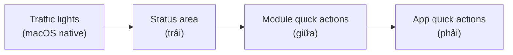

# Title bar

Title bar cao 30px, ngay sau 3 nút đèn giao thông macOS. Chia đúng **3 vùng cố định**, mỗi item trong cả 3 vùng chỉ là **icon + tooltip** — không có text label hiển thị trực tiếp trên bar.

import { Callout } from 'fumadocs-ui/components/callout';

<Callout type="warn" title="Design only — supersedes ADR-012 tab-strip trong title bar">
Trang này mô tả hướng thiết kế mới cho Phase 5 Workbench UI. Title bar không
còn tab nào cả — **chỉ 1 module active tại 1 thời điểm**, chuyển module qua
[Dock](/dev-kit/shell-primitives). Tab (`TabStrip`, `Reorder.Group`,
`openTab`/`pinTab`/`preview`) **không biến mất** — chuyển xuống content area,
mỗi module tự quản riêng, xem [Module tabs](/dev-kit/module-tabs). Chưa có
runtime — `frontend/src/workbench/Workbench.tsx` hiện tại vẫn chạy theo mô tả
ở `module-tabs.mdx`.
</Callout>

## Vùng 1 — Status area (trái)

Icon trạng thái hệ thống, cố định vị trí ngay sau traffic lights. Mỗi icon
**click được** — hành vi click **tuỳ từng item tự định nghĩa** (mở module, mở
dropdown, hoặc hành vi khác), không theo 1 pattern chung.

| Item | Ý nghĩa | Click mở gì (dự kiến) |
|---|---|---|
| Vault lock | Trạng thái khoá vault (`locked`/`unlocked`) | Có thể không cần — vào được Workbench nghĩa là đã `unlocked` |
| Sync status | `synced` / `syncing` / `offline` / `conflict` — icon đổi theo state | Module Sync (list conflict nếu có) |
| Agent Hub running | Có session agent nào đang chạy không | Module Agent Hub, focus session đang chạy |
| Code index status *(tương lai)* | Tiến trình index khi mở 1 source code project (CodeGraph) | Chưa quyết định |

<Callout type="info" title="Open question">
**Hiển thị đủ 4 icon cố định hay chỉ hiện icon nào đang "có gì đáng chú ý"**
(VD Code index chỉ hiện khi có project source code đang mở, ẩn hẳn lúc khác)
— **chưa quyết định (TBD)**. Cần chốt trước khi implement.
</Callout>

## Vùng 2 — Module quick action area (giữa)

Thay thế `TabStrip`. Module **đang active** tự do đăng ký icon+tooltip riêng
vào vùng này qua `moduleActions.ts` (title-bar action registry đã
**Implemented**, xem [Shell primitives](/dev-kit/shell-primitives) và
[ADR-011](/dev-kit/architecture-decisions#adr-011-shared-title-bar-actions-and-split-panel-for-module-side-content)).

`ModuleAction.label` render thành nội dung `Tooltip`; nút trên bar là icon
thuần (`Button size="icon-sm"`) — không có text label nào hiện trực tiếp trên
bar.

- Chỉ module đang active mới có action hiện ở đây; đổi module (qua Dock) thì
  đổi luôn tập icon (unregister theo `id` khi component unmount/`action` thành
  `null`, xem Shell primitives § Rules).
- Số lượng/thứ tự icon do module tự khai báo qua `useModuleAction`, không có
  registry trung tâm map `moduleId → icon` tách rời.
- Ví dụ minh hoạ (chưa chốt danh sách chính thức): Notes đã có `PanelRight`
  ("Note details") — consumer đầu tiên, xem Shell primitives § Consumer.

## Vùng 3 — App quick action area (phải)

Cố định, không đổi theo module:

| Icon | Hành động |
|---|---|
| Search | Mở command palette / tìm kiếm toàn app |
| Settings | Mở module Settings (popup) |

## Quan hệ với các trang khác

- **Tab chuyển đi, không biến mất**: [Module tabs](/dev-kit/module-tabs) —
  `TabStrip`/`Reorder`/multi-tab rời title bar, xuống content area, mỗi
  module tự quản store riêng.
- **Kế thừa nguyên trạng**: `moduleActions` registry
  ([ADR-011](/dev-kit/architecture-decisions#adr-011-shared-title-bar-actions-and-split-panel-for-module-side-content)) —
  không đổi field/behavior, chỉ xác nhận lại nó đã đúng icon+tooltip.
- **Điều hướng module (Dock)**: `Workbench.tsx` render dock (xem
  [Shell primitives](/dev-kit/shell-primitives) dòng đầu và
  [Implementation status](/dev-kit/implementation-status)) — **chưa có trang
  riêng mô tả chi tiết Dock**; cần 1 trang/section riêng nếu Dock trở thành
  cơ chế điều hướng module duy nhất (thay vì chỉ song song với tab-strip như
  hiện tại).

import { Cards, Card } from 'fumadocs-ui/components/card';

<Cards>
  <Card title="Module tabs" href="/dev-kit/module-tabs" description="Tab chuyển xuống content area, mỗi module tự quản riêng" />
  <Card title="Shell primitives" href="/dev-kit/shell-primitives" description="moduleActions registry + Dock" />
  <Card title="Roadmap" href="/dev-kit/roadmap" description="Phase 5 Workbench UI" />
</Cards>
