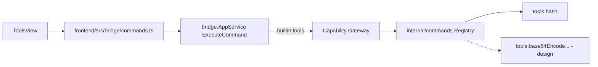

# Tools

Tools là built-in module mỏng bọc quanh `internal/commands.Registry` — mỗi
"tool" là 1 command đăng ký sẵn, chạy pure function, **không** đụng vaultitem
(không lưu gì, không có secret). Đây là điểm khác biệt lớn nhất so với
Vault/Notes/SSH/Database: Tools không có state, không cần vault unlocked.

## Principles

- Tool không tự ý đọc vault nếu chưa có capability.
- Ưu tiên built-in trước khi mở SDK ngoài.
- Mỗi tool có entry rõ trong registry để search/palette dùng được.

## Hiện tại: chỉ `tools.hash`

| Method | Capability | Scope |
|---|---|---|
| `ExecuteCommand` (command = `tools.hash`) | `tools:hash` | `command:tools.hash` |

Subject luôn `builtin.tools`. Registry hiện chỉ có **đúng 1 command** đăng ký
(`internal/tools/hash.go` qua `internal/commands/registry.go`) — dù bridge
format `command:<opaque-id>` tổng quát cho mọi command, runtime hiện tại chỉ
có 1 grant sống: `builtin.tools` / `tools:hash` / `command:tools.hash`.

## Design: thêm util command

Registry đã là generic — thêm command mới không cần đổi bridge/capability
shape, chỉ cần đăng ký handler mới. Đề xuất danh sách v1:

| Command ID | Input | Output |
|---|---|---|
| `tools.base64Encode` | text hoặc bytes | base64 string |
| `tools.base64Decode` | base64 string | text/bytes |
| `tools.uuidGenerate` | version (`v4` mặc định, `v7` optional) | UUID string |
| `tools.urlEncode` / `tools.urlDecode` | text | text |
| `tools.jsonFormat` | JSON text | pretty-printed JSON |

Tất cả pure function — không network, không mutate state, không cần vault
unlocked.

### Capability mới, không đổi grant cũ

Thêm 1 capability `tools:util` dùng chung cho toàn bộ nhóm command pure-function
mới, **tách khỏi `tools:hash` hiện có** — theo đúng "Compatibility rules" đã
chốt ở [Technical contracts](/dev-kit/technical-contracts#compatibility-rules):
thêm capability mới không đổi grant cũ được coi là backward-compatible. Không
dùng 1 capability riêng cho từng command (`tools:base64`, `tools:uuid`...) vì
risk profile của cả nhóm giống nhau (không network, không mutate) — khác hẳn
lý do SSH/DB tách `ssh:connect` / `ssh:forward` (risk khác nhau rõ rệt).

Scope vẫn `command:<id>` opaque như hiện tại, không cần đổi.

### NFR mới

- Input size limit cho mỗi command (ví dụ base64 decode 1 chuỗi khổng lồ) —
  tránh DoS cục bộ, chưa có limit nào ở registry hiện tại vì `tools.hash` input
  vốn nhỏ.

## MCP tool surface (design)

Xem cơ chế chung + rationale ở [MCP / Agent](/dev-kit/mcp-agent).

Khác với các module khác — **mỗi command nên là 1 MCP tool riêng** (`tools.base64Encode`,
`tools.uuidGenerate`...), không dùng 1 tool `tools.executeCommand` generic
duy nhất. Lý do: MCP tool cần `inputSchema` rõ ràng để agent gọi đúng; 1 tool
generic với input schema "tuỳ command" thì agent khó biết truyền gì. Mỗi MCP
tool vẫn map xuống cùng 1 bridge method `ExecuteCommand` với `command:<id>`
tương ứng ở tầng dưới — không nhân bản logic.

| MCP tool | Effect | Map sang |
|---|---|---|
| `tools.hash` | `read` | `builtin.tools` / `tools:hash` / `command:tools.hash` |
| `tools.base64Encode` / `tools.base64Decode` | `read` | `builtin.tools` / `tools:util` / `command:tools.base64Encode` (tương tự) |
| `tools.uuidGenerate` | `read` | `builtin.tools` / `tools:util` / `command:tools.uuidGenerate` |
| `tools.urlEncode` / `tools.urlDecode` | `read` | `builtin.tools` / `tools:util` / `command:tools.urlEncode` (tương tự) |
| `tools.jsonFormat` | `read` | `builtin.tools` / `tools:util` / `command:tools.jsonFormat` |

Tất cả `readOnlyHint = true` — pure function không có side effect, kể cả command
generate UUID (không mutate state nào, chỉ sinh giá trị mới).

## Known ceiling

- Chỉ pure-function utility — Tools không phải nơi cho business logic phức
  tạp hay bất cứ thứ gì cần I/O ngoài.
- Chưa có input size limit thật, chỉ mới nêu như NFR cần làm khi thêm command
  mới.

import { Cards, Card } from 'fumadocs-ui/components/card';

<Cards>
  <Card title="MCP / Agent" href="/dev-kit/mcp-agent" />
  <Card title="Technical contracts" href="/dev-kit/technical-contracts" description="Bridge Tools family + capability contract" />
  <Card title="Implementation status" href="/dev-kit/implementation-status" description="Built-in registry và capability boundaries" />
  <Card title="Runtime & process" href="/dev-kit/runtime" />
</Cards>
