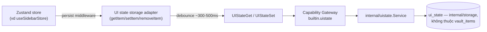

# UI state persistence

Chỗ lưu **duy nhất** cho preference UI cần nhớ qua lần khởi động lại app —
sidebar mở/đóng ([Sidebar](/dev-kit/sidebar)) là consumer đầu tiên, nhưng
thiết kế generic để tab, window bounds, theme, hay bất kỳ preference nào
khác dùng chung được, không phải xây riêng mỗi lần có feature mới cần nhớ
state.

import { Callout } from 'fumadocs-ui/components/callout';
import { Cards, Card } from 'fumadocs-ui/components/card';

<Callout type="warn" title="Design only">
Chưa có runtime.
</Callout>

## Vì sao không dùng `localStorage`/IndexedDB thẳng trong WebView

Wails chạy WKWebView (macOS) — độ bền storage trình duyệt qua các lần mở app
không đáng tin cậy tuyệt đối tuỳ cấu hình. Quan trọng hơn: dùng thẳng
`localStorage` tạo ra **1 đảo lưu trữ riêng** mà Go core không thấy/không
quản được — lệch khỏi nguyên tắc "Go core sở hữu mọi persistence, UI chỉ gọi
qua bridge typed" (ADR-001) và invariant "mọi call nhạy cảm đi qua
`AppService.call`" (ADR-003). `ui_state` không phải data nhạy cảm, nhưng vẫn
nên đi cùng đường ống với mọi persistence khác — không tạo ngoại lệ.

## Storage: bảng `ui_state`, ngoài vault

Cùng tiền lệ `env_tags` ([Environments](/dev-kit/environments)) — bảng riêng
trong `internal/storage`, **không phải** `vault_items`, không cần vault
`unlocked` để đọc/ghi:

Bảng `ui_state` có 3 cột: `key` (TEXT, primary key), `value` (TEXT chứa JSON),
và `updated_at`.

Generic key-value thay vì 1 bảng riêng cho từng feature — thêm 1 preference
mới không cần migration, chỉ cần 1 `key` mới.

- **Độc lập vault lock/unlock.** Sidebar (consumer đầu tiên) tự nó chỉ tồn
  tại post-unlock nên chỉ đọc/ghi sau đó — nhưng bản thân bảng `ui_state`
  không gate theo vault, vì consumer sau này (vd window bounds, theme) có
  thể cần đọc **trước cả lúc chưa unlock** (VD nhớ kích thước cửa sổ ngay ở
  màn hình Vault setup/unlock).

## Bridge

| Method | Capability | Scope |
|---|---|---|
| `UIStateGet(key)` | `ui:read` | `key:<key>` |
| `UIStateSet(key, value)` | `ui:write` | `key:<key>` |

Subject `builtin.uistate`. Vẫn qua `AppService.call` + Capability Gateway dù
data không nhạy cảm — không bypass invariant #1 của kiến trúc dù lý do "chỉ
là UI preference" nghe hợp lý, tính nhất quán của biên giới quan trọng hơn.

## Frontend: Zustand `persist` adapter

Viết **1 storage adapter khớp interface `persist` middleware của Zustand**
(`getItem`/`setItem`/`removeItem`) gọi bridge thay vì `localStorage` — dev
dùng cú pháp Zustand quen thuộc, không ai tự gọi bridge tay mỗi lần thêm 1
store mới cần nhớ:

Mỗi store chỉ cần bọc `persist(...)` với `name` riêng và `storage:
uiStateStorage`.

`uiStateStorage` là **1 implementation duy nhất, dùng chung** cho mọi store
cần persist — không viết lại adapter riêng mỗi consumer.

### Debounce bắt buộc

Event liên tục (kéo resize sidebar/panel, gõ phím...) **không được** gọi
bridge mỗi lần state đổi — `uiStateStorage.setItem` tự debounce ~300–500ms
sau khi ngừng thay đổi mới ghi xuống SQLite. Đọc (`getItem`) không debounce
— chỉ đọc 1 lần lúc store khởi tạo.

## Quan hệ với các trang khác

- **Consumer đầu tiên**: [Sidebar](/dev-kit/sidebar) — toggle open/closed
  global cần nhớ qua lần khởi động lại.
- **Tiền lệ storage**: [Environments](/dev-kit/environments) — `env_tags`
  là bảng đầu tiên chứng minh pattern "ngoài vault, không cần unlocked" đã
  hoạt động trong checkout thật.
- **Kế thừa invariant**: [Architecture decisions](/dev-kit/architecture-decisions) —
  ADR-001 (Go core sở hữu persistence), ADR-003 (Capability Gateway là
  choke point duy nhất cho call nhạy cảm — áp dụng cả khi data không nhạy
  cảm, để giữ nhất quán).

<Cards>
  <Card title="Sidebar" href="/dev-kit/sidebar" description="Consumer đầu tiên — toggle global cần persist" />
  <Card title="Environments" href="/dev-kit/environments" description="env_tags — tiền lệ bảng ngoài vault" />
  <Card title="Architecture decisions" href="/dev-kit/architecture-decisions" description="ADR-001, ADR-003 — invariant kế thừa" />
  <Card title="Shell primitives" href="/dev-kit/shell-primitives" description="moduleActions/SplitPanel — primitive khác cũng có thể cần persist sau này" />
</Cards>
