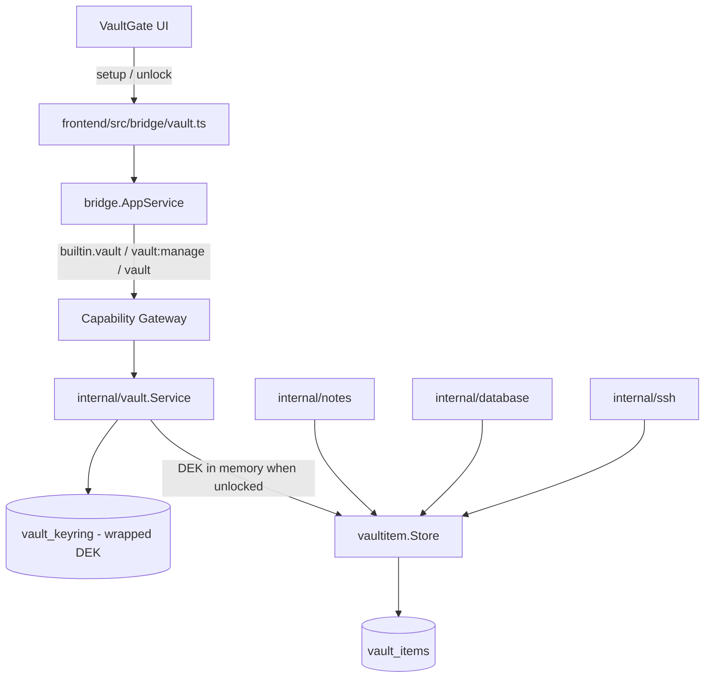

# Vault

Vault trong DevKit gồm **hai lớp tách rõ**:

1. **`internal/vault`** — lifecycle Master Password / keyring / DEK in-memory
   (setup → unlock → lock). Không lưu note hay connection profile.
2. **`internal/vaultitem`** — substrate item dùng chung (bảng `vault_items`,
   envelope V2). Notes / Database / SSH là thin adapter trên lớp này.

UI vault **không phải** ActivityBar module: `VaultGate` bọc toàn bộ Workbench
và chặn mọi module cho đến khi vault `unlocked`.

## States & lifecycle (runtime)

| State | Meaning |
|---|---|
| `not_configured` | Chưa có keyring — lần đầu phải `Setup` |
| `locked` | Keyring đã persist; DEK không có trong memory |
| `unlocked` | DEK nằm trong process memory; seal/open được |

Luồng thực tế:

1. **First run** — `SetupVault(masterPassword)` (≥ 8 ký tự). Tạo keyring
   (wrapped DEK + KDF), lưu `vault_keyring`, unlock ngay, **trả recovery key
   đúng một lần** (không log / audit / persist recovery key).
2. **Mọi process start sau đó** — DEK không còn → luôn `locked` cho đến khi
   `UnlockVault(masterPassword)` (hoặc `UnlockVaultWithRecovery` — bridge có,
   UI hiện chưa expose).
3. **`LockVault`** — zeroize DEK trong memory. Có trên bridge; Workbench hiện
   **không** có nút lock (chỉ restart process là về locked).

Production wiring (`main.go`): `vault.NewSQLKeyringStore` trên
`storage.TableVaultKeyring` + `vaultitem.NewSQLMutationRepository` (item write
kèm sync intent).

## Bridge & capability

| Method | Capability | Scope | UI |
|---|---|---|---|
| `VaultStatus` | `vault:manage` | `vault` | `VaultGate` |
| `SetupVault` | `vault:manage` | `vault` | Create Master Password |
| `UnlockVault` | `vault:manage` | `vault` | Unlock DevKit |
| `UnlockVaultWithRecovery` | `vault:manage` | `vault` | (bridge only) |
| `LockVault` | `vault:manage` | `vault` | (bridge only) |

Subject luôn `builtin.vault`. Sau setup/unlock/lock thành công, bridge ghi
audit riêng với capability **`vault:lifecycle`** (metadata `event` =
`setup|unlock|recovery_unlock|lock`) — không đi qua grant `vault:manage`.

Frontend adapter: `frontend/src/bridge/vault.ts` (`vaultStatus`, `setupVault`,
`unlockVault` only).

## Crypto substrate (không phải “vault module”)

- Envelope **V2-only** (`SealV2` / `OpenWithAD`), AAD =
  `record_type + NUL + record_id + NUL + key_id` —
  [ADR-005](/dev-kit/architecture-decisions#adr-005-v2-only-envelope-with-aad-binding).
- Application-layer encryption trên SQLite, không SQLCipher —
  [ADR-004](/dev-kit/architecture-decisions#adr-004-application-layer-encrypted-records-instead-of-sqlcipher).
- Shared store: `internal/vaultitem` + bảng `vault_items` —
  [ADR-008](/dev-kit/architecture-decisions#adr-008-unified-vault_items-store-for-built-in-item-types).
- `VaultSearch` (bridge `builtin.search` / `vault:search` / `item:search`)
  search metadata plaintext cross-type; **chưa có UI caller**.

## Consumers

| Module | `type` | Encrypted payload key id | Docs |
|---|---|---|---|
| Notes | `note` | `note-body` | [Notes](/dev-kit/notes) |
| SSH | `ssh-profile` | `ssh-secret` | [SSH](/dev-kit/connections) |
| Database | `db-profile` | `db-password` | Sibling module — xem [Implementation status](/dev-kit/implementation-status) |

`vaultitem` **không** import ngược `notes` / `database` / `ssh`
(`go test ./internal/arch/`).

## Rules

- Không log Master Password, recovery key, hay plaintext DEK.
- Recovery key chỉ hiện một lần sau setup — xem
  [Operations](/dev-kit/operations#recovery-and-troubleshooting).
- Plugin chỉ đụng vault/items qua capability khi plugin surface có.

import { Cards, Card } from 'fumadocs-ui/components/card';

<Cards>
  <Card title="SSH" href="/dev-kit/connections" description="Thin adapter ssh-profile trên vaultitem" />
  <Card title="Notes" href="/dev-kit/notes" description="Thin adapter đầu tiên trên vaultitem" />
  <Card title="Security model" href="/dev-kit/security" />
  <Card title="Technical contracts" href="/dev-kit/technical-contracts" />
  <Card title="Architecture decisions" href="/dev-kit/architecture-decisions" description="ADR-004/005/008" />
</Cards>
