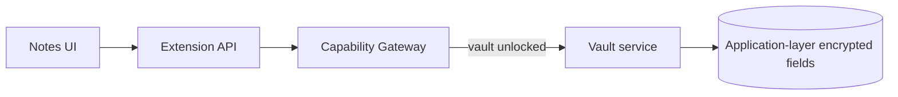

# Vault & notes

Vault chứa notes và dữ liệu nhạy cảm (connection secrets). Unlock vault mới cho phép thao tác giải mã có kiểm soát.

## Responsibilities

- Lưu notes local; body và secret fields mã hóa ở application layer trước khi persist vào SQLite.
- Phân loại dữ liệu nhạy cảm — không phải full-database encryption.
- Khóa/mở vault; không để UI giữ raw key lâu hơn cần thiết.

## Rules

- Không log plaintext secrets.
- Plugin chỉ đụng vault qua capability được cấp.
- Recovery/lockout phải được thiết kế trước khi ship.

import { Cards, Card } from 'fumadocs-ui/components/card';

<Cards>
  <Card title="Security model" href="/dev-kit/security" />
  <Card title="Data & sync" href="/dev-kit/data-sync" />
  <Card title="Architecture decisions" href="/dev-kit/architecture-decisions" description="ADR-004: application-layer encryption" />
</Cards>
