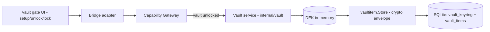

# Vault

Vault quản lý Master Password/DEK và cơ chế mã hóa application-layer dùng chung cho toàn bộ DevKit. Bản thân Vault **không lưu nội dung nghiệp vụ** (note, connection profile...) — đó là việc của các module consumer (Notes, Connections). Vault chỉ chịu trách nhiệm: khóa/mở, dẫn xuất khóa, và cung cấp substrate lưu trữ mã hóa dùng chung mà các module đó adapter vào.

## Responsibilities

- Setup/unlock/lock vault; không để UI giữ raw key lâu hơn cần thiết.
- Dẫn xuất DEK từ Master Password (Argon2id KDF) và giữ trong memory khi unlocked.
- Mã hóa/giải mã field nhạy cảm qua versioned crypto envelope (**V2-only**, XChaCha20-Poly1305, associated data binding `record_type + NUL + record_id + NUL + key_id` — xem [ADR-005](/dev-kit/architecture-decisions#adr-005-v2-only-envelope-with-aad-binding)).
- Cung cấp **substrate dùng chung** (`internal/vaultitem`, bảng `vault_items`) mà Notes/Database/SSH adapter vào thay vì mỗi module tự có store/crypto riêng — xem [ADR-008](/dev-kit/architecture-decisions#adr-008-unified-vault_items-store-for-built-in-item-types).
- Cross-type search (`VaultSearch`) trên metadata plaintext của mọi item type, không cần giải mã payload.

## Application-layer encryption, không phải full-DB encryption

SQLite (`devkit.db`) lưu JSON blob per record; chỉ secret field được mã hóa trước khi persist, không dùng SQLCipher — xem [ADR-004](/dev-kit/architecture-decisions#adr-004-application-layer-encrypted-records-instead-of-sqlcipher). Nhiều metadata (title, host, username) cố ý để plaintext để search/list được ngay cả khi vault đang locked.

## Consumers của substrate này

Vault không tự expose feature cho user — mọi built-in module dùng chung `vaultitem.Store` rồi tự định nghĩa bridge/capability riêng:

| Module | Record type | Field mã hóa | Trang riêng |
|---|---|---|---|
| Notes | `note` | `Body` | [Notes](/dev-kit/notes) |
| Database profile | `db-profile` | `Password` | [Connections](/dev-kit/connections) |
| SSH profile | `ssh-profile` | secret material | [Connections](/dev-kit/connections) |

## Rules

- Không log plaintext secrets.
- Plugin chỉ đụng vault qua capability được cấp khi plugin surface có.
- Master Password và recovery key thuộc vault lifecycle — xem [Operations](/dev-kit/operations#recovery-and-troubleshooting).

import { Cards, Card } from 'fumadocs-ui/components/card';

<Cards>
  <Card title="Notes" href="/dev-kit/notes" description="Module consumer đầu tiên của substrate này" />
  <Card title="Connections" href="/dev-kit/connections" description="Database/SSH cũng adapter trên vaultitem" />
  <Card title="Security model" href="/dev-kit/security" />
  <Card title="Data & sync" href="/dev-kit/data-sync" />
  <Card title="Architecture decisions" href="/dev-kit/architecture-decisions" description="ADR-004/005/008: envelope và unified store" />
</Cards>
