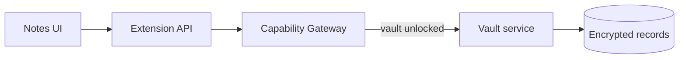

# Vault & notes

Vault chứa notes/snippets và dữ liệu nhạy cảm. Unlock vault mới cho phép thao tác giải mã có kiểm soát.

## Trách nhiệm

- Lưu notes/snippets local.
- Phân loại dữ liệu nhạy cảm.
- Khóa/mở vault; không để UI giữ raw key lâu hơn cần thiết.

## Quy tắc

- Không log plaintext secrets.
- Plugin chỉ đụng vault qua capability được cấp.
- Recovery/lockout phải được thiết kế trước khi ship.

import { Cards, Card } from 'fumadocs-ui/components/card';

<Cards>
  <Card title="Security model" href="/dev-kit/security" />
  <Card title="Data & sync" href="/dev-kit/data-sync" />
</Cards>
