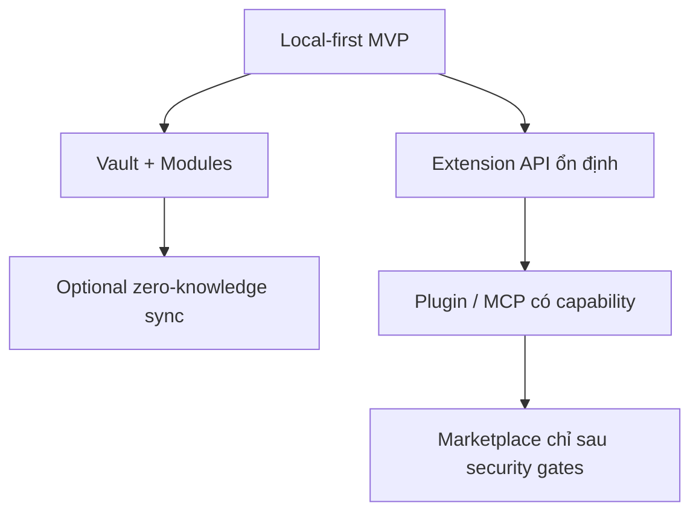

# Vision & principles

DevKit hướng tới workspace local-first: hữu ích khi offline, bảo vệ secrets mạnh, và có hợp đồng mở rộng ổn định cho plugin/AI.

## 10 principles

1. **Local-first by default** — notes, tools, vault, SSH chạy offline.
2. **Zero-knowledge sync** — server chỉ giữ encrypted blob + metadata.
3. **Stable extension contracts** — plugin gọi Extension API, không gọi internal Go.
4. **Least privilege** — plugin khai báo capability; host grant/deny/audit/revoke.
5. **Lazy activation** — chỉ load shell + phần đang cần.
6. **Built-in modules trước external plugins**.
7. **Security boundaries trước marketplace**.
8. **Threat model trước khi implement module nhạy cảm**.
9. **Compatibility là product feature** — schema/protocol/API migration-friendly.
10. **Performance budgets** — startup, search, sync, plugin activation có budget rõ.

## Terminology

| Term | Meaning |
|---|---|
| Extension API | Surface công khai plugin được gọi |
| Capability API | Phần Extension API có kiểm soát quyền |
| Capability Gateway | Biên giới Go kiểm tra identity/permission trước khi vào core |
| Hook | Callback vòng đời (`onVaultUnlocked`, …) — chỉ thông báo, không mở internal service |
