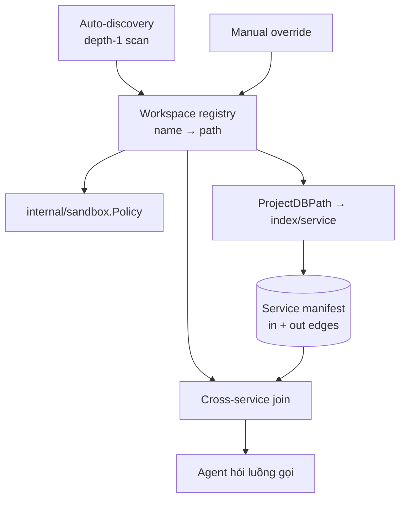

# Workspace

Workspace là một **danh sách có tên gồm các cặp `(service name → path trên đĩa)`**.
Chỉ vậy. Nó nhỏ vì nó phải phục vụ ba consumer không liên quan nhau, và mỗi
consumer chỉ cần một nửa của cặp đó:

| Consumer | Cần gì | Dùng làm gì |
|---|---|---|
| Sandbox | **path** | Dựng `WorkDir` / `ReadWritePaths` / `ReadOnlyPaths` cho từng agent |
| CodeGraph | **path** | `ProjectDBPath` hash path → index riêng cho từng service |
| Cross-service flow | **name** | Join outbound call của service A với inbound endpoint của service B |

Không có khái niệm nào khác giải được cả ba. Đó là lý do workspace tồn tại
như một registry riêng thay vì nhét vào Agent Hub hay CodeGraph.

import { Callout } from 'fumadocs-ui/components/callout';

<Callout type="warn" title="Design — chưa implement">
Toàn bộ trang này là thiết kế. Runtime hiện tại: `internal/codegraph/service.go`
chỉ giữ **một** project active (`activeProject`, `SetProjectPath`), đúng FR-1 của
[CodeGraph](/dev-kit/codegraph). `internal/agenthub/adapter_claude.go` set
`WorkDir` = project path cho mọi agent, nên nhiều agent trên cùng project dùng
chung một thư mục ghi. Workspace là lớp đứng trên, **không** sửa hai thứ đó.
</Callout>

## Vì sao không dùng lại "cluster"

Từ `cluster` đã thuộc về Kafka trong toàn bộ doc (`kafka.mdx`,
`active_kafka.go`, popup chọn cluster ở MCP). Dùng lại sẽ gây nhầm ở đúng chỗ
nguy hiểm: cả hai đều là "một tập thứ được chọn active". Workspace là từ mới,
không đụng.

## Data model

Bảng `workspaces` và `workspace_services` trong `internal/storage`, **machine-local,
không sync**. Lý do giống NFR-4 của CodeGraph: path là thứ chỉ đúng trên một
máy. Sync một danh sách path sang máy khác thì mọi entry đều sai.

| Field | Value |
|---|---|
| `workspace.id` | 24 lowercase hex (`vaultitem.NewID`) |
| `workspace.name` | Tên do người đặt, hoặc tên thư mục cha |
| `workspace.root` | Thư mục cha chứa các service (nguồn cho auto-discovery) |
| `service.name` | Tên logic — thứ xuất hiện trong URL giữa các service |
| `service.path` | Path tuyệt đối tới repo |
| `service.name_source` | `config` \| `folder` \| `manual` — xem phần dưới |

Một service **không** cần nằm dưới `root`. `root` chỉ là gợi ý cho lần quét
đầu; thêm tay một repo ở chỗ khác vẫn hợp lệ.

## Auto-discovery

Yêu cầu: tự động hết mức có thể, và **không được lag khi mở nhiều project**.
Ba bước, xếp theo giá tăng dần, dừng ở bước rẻ nhất còn đúng.

**Bước 1 — tìm service.** Đọc thư mục `root` ở **độ sâu 1**, giữ mục nào có
`.git`. Không đệ quy. Một `readdir` cộng một `stat` mỗi mục con — vài
mili-giây kể cả với vài chục repo. Đệ quy toàn cây là thứ duy nhất ở bước này
có thể gây lag, nên nó bị loại.

**Bước 2 — đặt tên service.** Tên trong URL (`http://billing-service/refunds`)
**không** suy được chắc chắn từ tên thư mục. Nguồn đúng là
`spring.application.name` trong `application.yml` / `application.properties`.
Đọc đúng một file nhỏ ở đường dẫn cố định (`src/main/resources`) cho mỗi
service; miss thì fallback tên thư mục. Ghi lại nguồn vào `name_source` để UI
nói được tên này chắc hay đoán.

**Bước 3 — người sửa.** Sửa tay luôn thắng và `name_source` thành `manual`;
lần rescan sau không ghi đè lên nó.

Rescan chạy khi mở workspace và khi người bấm **Rescan** — không có watcher
trên `root`. Watcher ở đây sẽ nổ mỗi lần một agent đụng file trong bất kỳ
service nào, đổi lấy thông tin gần như không bao giờ đổi (danh sách repo).

## Hai tầng index — chỗ quyết định chuyện lag

Đây là phần quan trọng nhất của trang. Chi phí index **không** tỉ lệ với kích
thước project; nó bị chi phối bởi symbol solver.

`analyzer/src/main/java/com/devkit/codegraph/TypeSolverFactory.java` walk toàn
bộ `~/.m2/repository` và `~/.gradle/caches`, rồi mở **mọi** jar tìm được thành
một `JarTypeSolver`. Trên máy này đếm được 554 jar; trên một máy Java thật con
số là hàng nghìn. Và `internal/codegraph/service.go` re-index bằng cách chạy
lại **toàn bộ** analyze (`s.analyzer.Analyze`), debounce 750ms — không phải
incremental. Nhân chi phí đó với N service trong một workspace là công thức
chắc chắn lag.

Lối thoát nằm ở một quan sát đo được:
`analyzer/.../EndpointExtractor.java` **thuần AST** — nó chỉ đọc annotation
name, không gọi `resolve()`, không chạm solver. Nghĩa là thứ mà cross-service
cần có thể lấy được mà **không trả một đồng nào cho solver**.

| | Manifest tier | Full index tier |
|---|---|---|
| Cần symbol solver | Không | Có (walk `~/.m2`) |
| Phạm vi | Mọi service trong workspace | Chỉ project đang active |
| Nội dung | Inbound endpoint + outbound HTTP call | Node, edge, call site, field access |
| Kích hoạt | Khi mở workspace, khi rescan | `OpenProject` — không đổi |
| Đơn vị cache | Từng file, theo `mtime` + `size` | Cả project |

Manifest chạy như một mode phụ của chính analyzer jar (cờ dòng lệnh), bỏ qua
`TypeSolverFactory` hoàn toàn. Trong mode đó, trước khi parse là một lượt quét
byte tìm các chuỗi mốc (`@RestController`, `@RequestMapping`, `@FeignClient`,
`RestTemplate`, `WebClient`); chỉ file trúng mới được parse. Ở một service
điển hình đó là vài phần trăm số file.

FR-1 "chỉ 1 project active" **không đổi**. Manifest không phải index — nó
không có node, không tra cứu được, không hiện trong graph. Nó chỉ là hai danh
sách cạnh biên.

## Outbound edge — phần analyzer còn thiếu

Đo được: analyzer hiện **không** nhận diện `RestTemplate`, `WebClient`, hay
`@FeignClient`. Annotation duy nhất nó biết là `RestController`,
`RequestMapping`, `Get/Post/Put/Delete/PatchMapping`, `Service`, `Repository`,
`Autowired` (`LayerClassifier.java`, `EndpointExtractor.java`).

Nhưng lời gọi xuyên service **đã** để lại dấu vết trong index, vì
`ProjectAnalyzer.addCallEdges` không còn `continue` khi resolve thất bại — nó
ghi vào `call_sites` kèm lý do (`CallSite.java`: `"" | "library" | "interface"
| "unresolved"`):

| Cách gọi | Lý do được ghi | Vì sao |
|---|---|---|
| `restTemplate.postForObject(...)` | `library` | Callee nằm trong jar Spring, `JavassistMethodDeclaration` không bao giờ có AST |
| `@FeignClient` interface | `interface` | Implementation sinh lúc runtime, không có API tìm subclass |

Cross-service **không phải bức tường thứ tư**. Nó là hai bức tường đã có tên,
nhưng đầu bên kia nằm trong workspace của bạn — nên vượt được, trong khi
`library` thật (JDK, `PreparedStatement`) thì không. Việc còn thiếu chỉ là
trích `(http method, path, target service)` từ đúng những call site đó.

## Join — tính khi hỏi

Chốt: cạnh cross-service tính **lúc agent hỏi**, cộng một hành động rescan tay.
Không có background job nào duy trì chúng. Cùng triết lý với `traceDataFlow`
vốn đã "bounded, theo yêu cầu, không cache".

Join là ghép outbound của A với inbound của B theo `(method, path)` sau khi
resolve `target service` qua registry. Không phải cạnh nào cũng nối được, và
cái không nối được **không bị nuốt** — nó mang trạng thái:

| Trạng thái | Nghĩa |
|---|---|
| `linked` | Nối được tới một endpoint cụ thể |
| `dynamic-url` | URL ghép từ biến, không fold được thành literal |
| `unknown-service` | Tên host không có trong registry |
| `endpoint-gone` | Tên service khớp, route thì không |
| `external` | Host ngoài, không thuộc workspace |

`dynamic-url` là giới hạn thật, không phải bug. Đoán bừa một endpoint còn tệ
hơn nói thẳng là không biết — đúng nguyên tắc `unresolved` sẵn có: không im
lặng bỏ qua, cũng không bịa.

`endpoint-gone` xuất hiện vì manifest của A và của B quét ở hai thời điểm khác
nhau. Vì re-index là full analyze chứ không incremental, không có cách nào giữ
hai bên luôn đồng bộ mà không trả giá lag. Hiển thị drift đúng như nó là, rẻ
hơn và trung thực hơn.

## Worktree dùng chung registry

Worktree không cần khái niệm mới. Nó là **cùng workspace đó, khác ánh xạ path**.

Workspace `acme` ở trạng thái thường trỏ mỗi service về repo chính. Workspace
`acme @ task-123` trỏ những service mà agent được phép sửa về worktree riêng,
còn lại giữ nguyên repo chính. Sandbox đọc đúng bảng đó ra policy: service
đang sửa vào `ReadWritePaths`, phần còn lại vào `ReadOnlyPaths`.

Lồng "thư mục cha read-only, một service bên trong read-write" **chạy được trên
macOS** vì rule `allow` của Seatbelt cộng dồn theo từng operation (đo live).
**Trên Linux thì chưa**: bubblewrap mount theo thứ tự argv, và
`internal/sandbox/bwrap_args.go` phát RW bind *trước* RO bind, nên `--ro-bind`
cha phát sau **đè lên** bind RW của con — con thành read-only. Cần đổi thứ tự
(RO cha trước, RW con sau) trong bwrap; chưa có test cho case này và chưa đo
trên máy Linux.

Một ràng buộc git làm tier worktree phức tạp hơn dự tính: worktree liên kết có
`.git` là *file* trỏ vào `<primary>/.git/worktrees/<name>/`, nơi chứa index và
HEAD. Primary repo read-only → `git add` / `commit` trong worktree fail
(`index.lock: Permission denied`, đo live). Vậy "service khác → RO" phải chừa
`<primary>/.git/worktrees/<name>` là RW cho đúng agent đó.

Từ đó ra hai tier, khớp với cách bạn làm việc thật (thường sửa khác service,
nhưng không phải luôn):

**Khác service — không cần worktree.** Mỗi agent RW đúng service của mình, cả
thư mục cha RO. Không tạo worktree nào, không tốn đĩa, không có bước dọn. Đây
là đường mặc định vì nó phủ đa số.

**Cùng service — mới bật worktree.** Chỉ service bị tranh chấp mới có worktree
riêng cho từng agent; các service khác vẫn RO trỏ về repo chính.

Vì `internal/codegraph/paths.go` đã hash project path để ra file index, mỗi
worktree tự có *file* index riêng — nhưng là index **nguội**: mỗi worktree mới
trả trọn một lần dựng solver (walk `~/.m2`). Worktree nhân chi phí full index
theo số agent; chỉ manifest tier là rẻ. Join vẫn chạy qua chúng vì làm việc
trên tên service chứ không trên path.

## Known ceiling

- **URL động** không fold được thành literal → `dynamic-url`. Không có kế hoạch
  giải triệt để; constant-folding liên thủ tục đắt hơn giá trị nó mang lại.
- **Manifest và full index có thể lệch nhau** về thời điểm. Manifest rẻ nên
  quét lại thường xuyên hơn; đây là đánh đổi có chủ ý.
- **Chỉ Java/Spring.** Service viết bằng ngôn ngữ khác vào registry được (để
  sandbox và worktree dùng) nhưng không có manifest, nên chỉ xuất hiện ở đầu
  `external` của một cạnh.
- **Solver setup vẫn walk toàn bộ `~/.m2` mỗi lần analyze.** Manifest tier né
  được nó, full index thì không — và worktree **nhân** nó lên theo số agent.
  `analyzer_subprocess.go` cũng chưa giới hạn số JVM chạy song song; watcher
  trong `codegraph/service.go` là singleton nên chỉ project active có freshness.

## Non-goals (v1)

- Nhiều project active cùng lúc trong CodeGraph — FR-1 giữ nguyên
- Sync workspace giữa các máy — path là machine-local
- Watcher trên thư mục `root`
- Suy ra topology từ service mesh / discovery server đang chạy
- Message queue như một cạnh cross-service (chỉ HTTP ở v1)

import { Cards, Card } from 'fumadocs-ui/components/card';

<Cards>
  <Card title="CodeGraph" href="/dev-kit/codegraph" description="FR-1, ba bức tường, call_sites" />
  <Card title="Agent Hub" href="/dev-kit/agent-hub" description="Consumer của workspace path" />
  <Card title="Sandbox" href="/dev-kit/sandbox" description="Policy dựng từ workspace" />
  <Card title="Tasks" href="/dev-kit/tasks" description="Task liên kết mềm tới worktree" />
</Cards>
