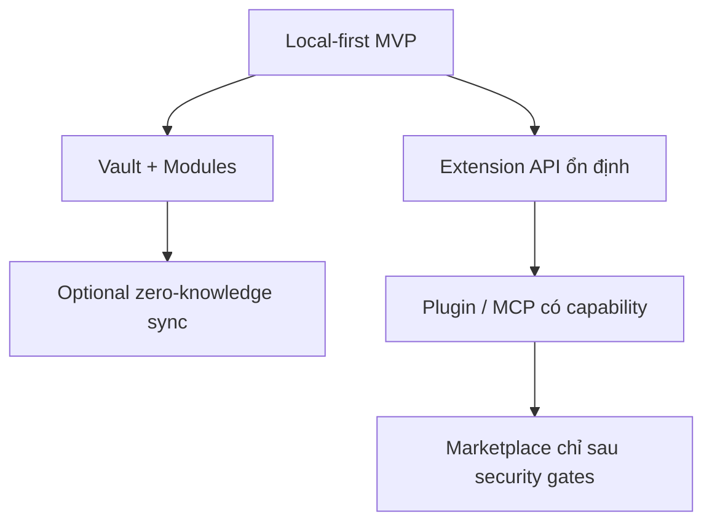
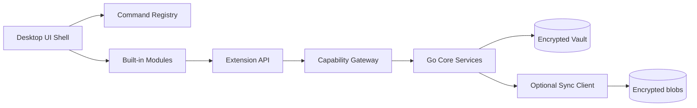
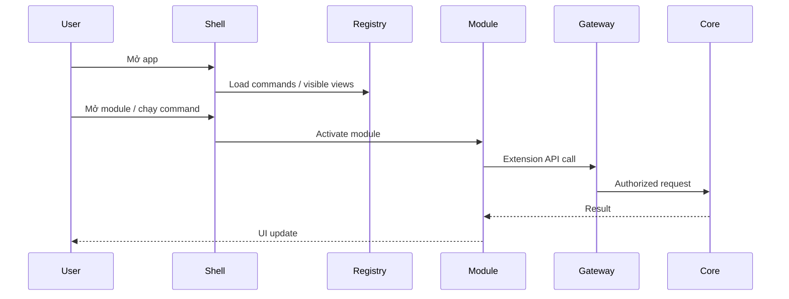
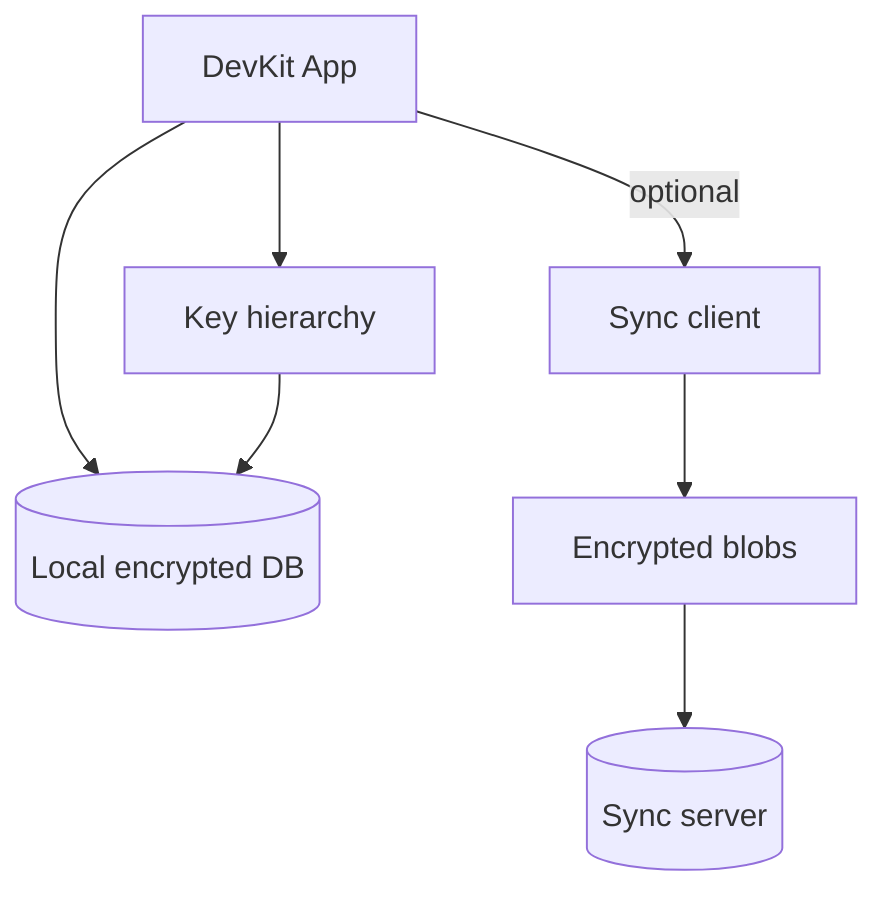
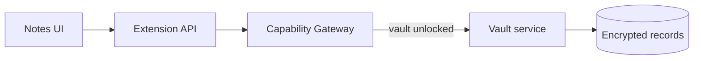
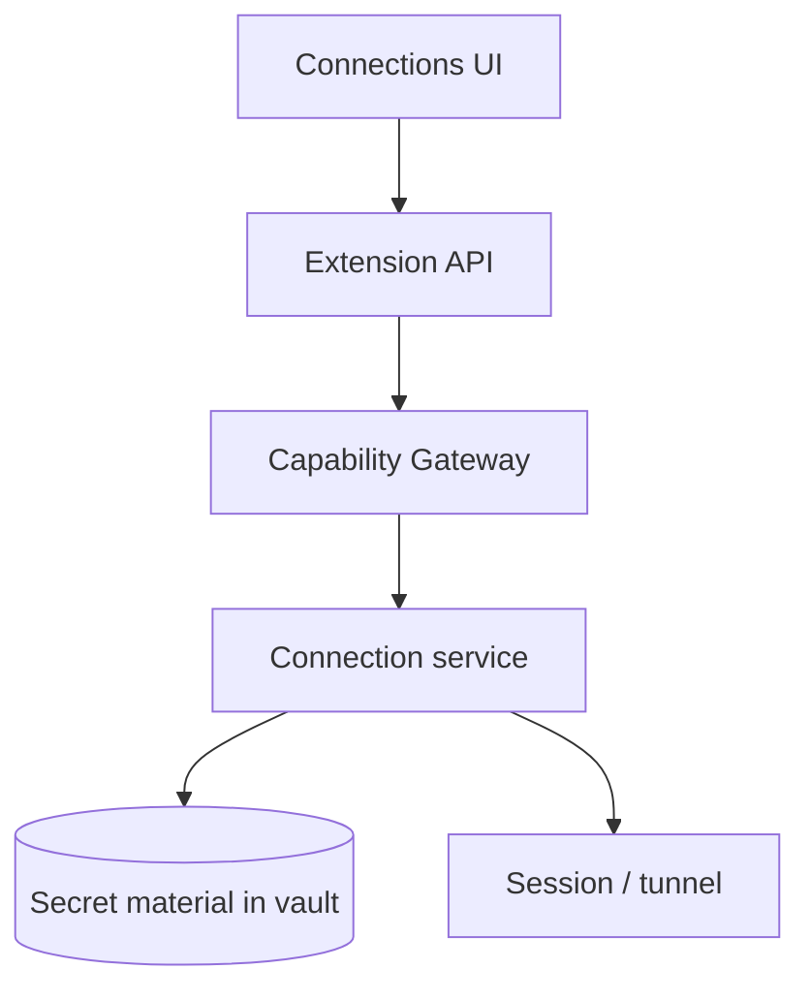
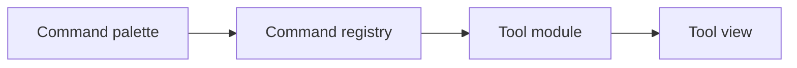
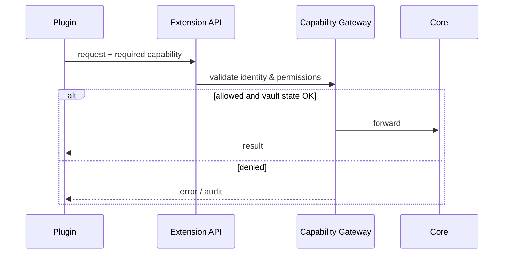
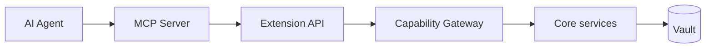
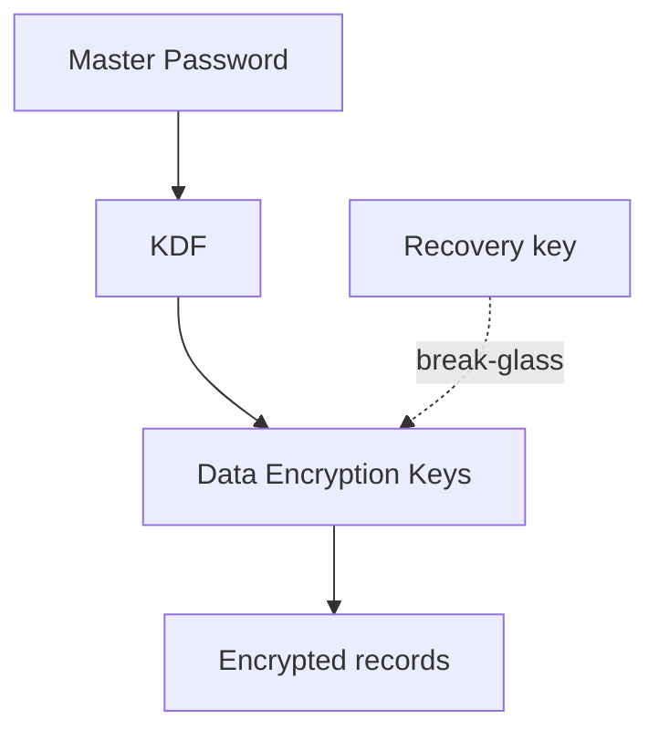

# DevKit Vietnamese Docs Redesign Implementation Plan

> **For agentic workers:** REQUIRED SUB-SKILL: Use superpowers:subagent-driven-development (recommended) or superpowers:executing-plans to implement this plan task-by-task. Steps use checkbox (`- [ ]`) syntax for tracking.

**Goal:** Replace English DevKit docs with a Vietnamese Hybrid IA, Mermaid-first pages, and Vietnamese garden/nav (README stays English).

**Architecture:** Keep existing Next.js + Fumadocs routes (`/{project}/...`). Enable Mermaid MDX rendering, replace `content/projects/dev-kit/*` with the approved page tree, rewrite content in Vietnamese while keeping English technical terms, and localize garden/nav chrome.

**Tech Stack:** Next.js 16, Fumadocs UI/MDX, Mermaid + next-themes, bun

**Spec:** `docs/superpowers/specs/2026-07-12-devkit-docs-vi-redesign.md`

---

## File map

| File | Responsibility |
|---|---|
| `package.json` / `bun.lock` | Add `mermaid`, `next-themes` |
| `source.config.ts` | Enable `remarkMdxMermaid` |
| `components/mdx/mermaid.tsx` | Client Mermaid renderer |
| `components/mdx.tsx` | Register `Mermaid` |
| `content/projects/dev-kit/meta.json` | New sidebar tree |
| `content/projects/dev-kit/*.mdx` | Vietnamese pages (new set) |
| `app/page.tsx` | Vietnamese garden copy |
| `lib/layout.shared.tsx` | Vietnamese nav title |
| `app/layout.tsx` | Optional `lang="vi"` |

Delete after new tree lands: `architecture.mdx`, `core-foundation.mdx`, `project-structure.mdx`, `mcp-agent-integration.mdx` (old English).

---

### Task 1: Enable Mermaid rendering

**Files:**
- Modify: `package.json` (via bun)
- Modify: `source.config.ts`
- Create: `components/mdx/mermaid.tsx`
- Modify: `components/mdx.tsx`

- [ ] **Step 1: Install dependencies**

```bash
bun add mermaid next-themes
```

Expected: both packages appear in `dependencies`.

- [ ] **Step 2: Update `source.config.ts`**

```ts
import { remarkMdxMermaid } from 'fumadocs-core/mdx-plugins';
import { defineConfig, defineDocs } from 'fumadocs-mdx/config';

export const docs = defineDocs({
  dir: 'content/projects',
});

export default defineConfig({
  mdxOptions: {
    remarkPlugins: [remarkMdxMermaid],
  },
});
```

- [ ] **Step 3: Create `components/mdx/mermaid.tsx`**

```tsx
'use client';

import { use, useEffect, useId, useState } from 'react';
import { useTheme } from 'next-themes';

export function Mermaid({ chart }: { chart: string }) {
  const [mounted, setMounted] = useState(false);

  useEffect(() => {
    setMounted(true);
  }, []);

  if (!mounted) return null;
  return <MermaidContent chart={chart} />;
}

const cache = new Map<string, Promise<unknown>>();

function cachePromise<T>(key: string, setPromise: () => Promise<T>): Promise<T> {
  const cached = cache.get(key);
  if (cached) return cached as Promise<T>;

  const promise = setPromise();
  cache.set(key, promise);
  return promise;
}

function MermaidContent({ chart }: { chart: string }) {
  const id = useId();
  const { resolvedTheme } = useTheme();
  const { default: mermaid } = use(cachePromise('mermaid', () => import('mermaid')));

  mermaid.initialize({
    startOnLoad: false,
    securityLevel: 'loose',
    fontFamily: 'inherit',
    themeCSS: 'margin: 1.5rem auto 0;',
    theme: resolvedTheme === 'dark' ? 'dark' : 'default',
  });

  const { svg, bindFunctions } = use(
    cachePromise(`${chart}-${resolvedTheme}`, () => {
      return mermaid.render(id.replaceAll(':', ''), chart.replaceAll('\\n', '\n'));
    }),
  );

  return (
    <div
      ref={(container) => {
        if (container) bindFunctions?.(container);
      }}
      dangerouslySetInnerHTML={{ __html: svg }}
    />
  );
}
```

- [ ] **Step 4: Register Mermaid in `components/mdx.tsx`**

```tsx
import defaultMdxComponents from 'fumadocs-ui/mdx';
import { Mermaid } from '@/components/mdx/mermaid';
import type { MDXComponents } from 'mdx/types';

export function getMDXComponents(components?: MDXComponents) {
  return {
    ...defaultMdxComponents,
    Mermaid,
    ...components,
  } satisfies MDXComponents;
}

export const useMDXComponents = getMDXComponents;

declare global {
  type MDXProvidedComponents = ReturnType<typeof getMDXComponents>;
}
```

- [ ] **Step 5: Commit**

```bash
git add package.json bun.lock source.config.ts components/mdx.tsx components/mdx/mermaid.tsx
git commit -m "feat: enable Mermaid diagrams in Fumadocs MDX"
```

---

### Task 2: Replace meta.json and remove English pages

**Files:**
- Replace: `content/projects/dev-kit/meta.json`
- Delete: `content/projects/dev-kit/architecture.mdx`
- Delete: `content/projects/dev-kit/core-foundation.mdx`
- Delete: `content/projects/dev-kit/project-structure.mdx`
- Delete: `content/projects/dev-kit/mcp-agent-integration.mdx`
- Keep temporarily: `content/projects/dev-kit/index.mdx` until Task 3 overwrites it

- [ ] **Step 1: Write new `meta.json`**

```json
{
  "title": "DevKit",
  "description": "Workspace desktop local-first cho developer",
  "root": true,
  "pages": [
    "---Giới thiệu---",
    "index",
    "vision",
    "---Kiến trúc---",
    "system-overview",
    "runtime",
    "data-sync",
    "---Modules---",
    "vault",
    "connections",
    "tools",
    "plugins",
    "---AI & bảo mật---",
    "mcp-agent",
    "security",
    "---Engineering---",
    "repo-structure",
    "core-foundation",
    "open-questions"
  ]
}
```

- [ ] **Step 2: Delete obsolete English MDX files**

```bash
rm content/projects/dev-kit/architecture.mdx \
  content/projects/dev-kit/core-foundation.mdx \
  content/projects/dev-kit/project-structure.mdx \
  content/projects/dev-kit/mcp-agent-integration.mdx
```

- [ ] **Step 3: Commit**

```bash
git add content/projects/dev-kit/meta.json
git add -u content/projects/dev-kit
git commit -m "refactor: reset DevKit docs tree for Vietnamese IA"
```

---

### Task 3: Intro pages (index + vision)

**Files:**
- Write: `content/projects/dev-kit/index.mdx`
- Create: `content/projects/dev-kit/vision.mdx`

- [ ] **Step 1: Write `index.mdx`**

```mdx
---
title: Tổng quan
description: DevKit là workspace desktop local-first cho developer.
---

# Tổng quan

DevKit là ứng dụng desktop đa nền tảng giúp developer làm việc offline-first: utilities hàng ngày, knowledge được mã hóa, quản lý kết nối an toàn, và nền tảng plugin mở rộng.

import { Cards, Card } from 'fumadocs-ui/components/card';

<Cards>
  <Card title="Tầm nhìn & nguyên tắc" href="/dev-kit/vision" description="Local-first, zero-knowledge, least privilege" />
  <Card title="Sơ đồ hệ thống" href="/dev-kit/system-overview" description="Shell, modules, vault, sync" />
  <Card title="MCP / Agent" href="/dev-kit/mcp-agent" description="AI agent truy cập có kiểm soát" />
  <Card title="Security model" href="/dev-kit/security" description="Threat model và encryption" />
</Cards>

## Vì sao tồn tại

- Giữ secrets (SSH, DB, token, notes) trên máy, không phụ thuộc cloud để dùng hàng ngày.
- Sync chỉ là lớp tùy chọn, server không cần plaintext.
- Plugin/AI đi qua Extension API + Capability Gateway, không gọi thẳng internal services.

## Không nằm trong MVP

- Public plugin marketplace
- Team vault / realtime collaboration
- Load plugin bên thứ ba chưa được tin cậy
```

- [ ] **Step 2: Write `vision.mdx`**

```mdx
---
title: Tầm nhìn & nguyên tắc
description: Nguyên tắc thiết kế cốt lõi của DevKit.
---

# Tầm nhìn & nguyên tắc

DevKit hướng tới workspace local-first: hữu ích khi offline, bảo vệ secrets mạnh, và có hợp đồng mở rộng ổn định cho plugin/AI.



## 10 nguyên tắc

1. **Local-first by default** — notes, tools, vault, connections chạy offline.
2. **Zero-knowledge sync** — server chỉ giữ encrypted blob + metadata.
3. **Stable extension contracts** — plugin gọi Extension API, không gọi internal Go.
4. **Least privilege** — plugin khai báo capability; host grant/deny/audit/revoke.
5. **Lazy activation** — chỉ load shell + phần đang cần.
6. **Built-in modules trước external plugins**.
7. **Security boundaries trước marketplace**.
8. **Threat model trước khi implement module nhạy cảm**.
9. **Compatibility là product feature** — schema/protocol/API migration-friendly.
10. **Performance budgets** — startup, search, sync, plugin activation có ngân sách rõ.

## Thuật ngữ quan trọng

| Thuật ngữ | Ý nghĩa |
|---|---|
| Extension API | Surface công khai plugin được gọi |
| Capability API | Phần Extension API có kiểm soát quyền |
| Capability Gateway | Biên giới Go kiểm tra identity/permission trước khi vào core |
| Hook | Callback vòng đời (`onVaultUnlocked`, …) — chỉ thông báo, không mở internal service |
```

- [ ] **Step 3: Commit**

```bash
git add content/projects/dev-kit/index.mdx content/projects/dev-kit/vision.mdx
git commit -m "docs(dev-kit): add Vietnamese intro pages"
```

---

### Task 4: Architecture pages (system-overview, runtime, data-sync)

**Files:**
- Create: `content/projects/dev-kit/system-overview.mdx`
- Create: `content/projects/dev-kit/runtime.mdx`
- Create: `content/projects/dev-kit/data-sync.mdx`

- [ ] **Step 1: Write `system-overview.mdx`**

```mdx
---
title: Sơ đồ hệ thống
description: Nhìn tổng thể shell, modules, vault và sync của DevKit.
---

# Sơ đồ hệ thống

DevKit tách UI shell, built-in modules, vault mã hóa, và sync tùy chọn. Mọi truy cập nhạy cảm đi qua biên giới rõ ràng.



## Các lớp chính

1. **UI Shell** — điều hướng, command palette, theme, cửa sổ.
2. **Built-in modules** — vault/notes, connections, tools, plugins host.
3. **Extension API + Capability Gateway** — hợp đồng an toàn cho plugin/MCP.
4. **Go core services** — crypto, storage, SSH/DB adapters, sync client.
5. **Local vault** — dữ liệu mã hóa trên máy.
6. **Optional sync** — upload/download blob đã mã hóa.

## Ranh giới quan trọng

- UI/plugin **không** đọc DEK/Master Password trực tiếp.
- Sync server **không** cần plaintext notes/secrets.
- Hook chỉ notify; hành động phải qua Extension API.

import { Cards, Card } from 'fumadocs-ui/components/card';

<Cards>
  <Card title="Runtime & process" href="/dev-kit/runtime" />
  <Card title="Data & sync" href="/dev-kit/data-sync" />
  <Card title="Security model" href="/dev-kit/security" />
</Cards>
```

- [ ] **Step 2: Write `runtime.mdx`**

```mdx
---
title: Runtime & process
description: Cách DevKit khởi động, kích hoạt module và chạy lệnh.
---

# Runtime & process

Runtime ưu tiên khởi động nhanh: load shell + trạng thái vault + registry, rồi lazy-activate phần còn lại.



## Thành phần runtime

- **Shell process** — UI + orchestration.
- **Command registry** — danh sách lệnh built-in/plugin.
- **Module loader** — kích hoạt module khi cần.
- **Capability Gateway** — chặn request thiếu quyền / vault locked.
- **Background workers** — sync, indexing, health checks (lazy).

## Ngân sách hiệu năng (định hướng)

| Hạng mục | Mục tiêu |
|---|---|
| Cold start đến UI dùng được | Nhanh, chỉ load phần visible |
| Activate module lần đầu | Lazy, không block toàn app |
| Search local | Giữ mượt khi vault lớn dần |

import { Callout } from 'fumadocs-ui/components/callout';

<Callout title="Lazy activation">
Đừng load toàn bộ plugin/module lúc startup. Chỉ shell, vault state, registry và view đang mở.
</Callout>
```

- [ ] **Step 3: Write `data-sync.mdx`**

```mdx
---
title: Data & sync
description: Mô hình dữ liệu local-first và sync zero-knowledge.
---

# Data & sync

Dữ liệu sống trên máy trước. Sync là lớp tùy chọn: client mã hóa, server lưu blob.



## Local-first

- Notes, snippets, connection profiles, secrets thuộc vault local.
- App phải dùng được khi mất mạng.
- Schema local cần migration-friendly ngay từ đầu.

## Zero-knowledge sync

1. Client mã hóa trước khi upload.
2. Server lưu blob + metadata tài khoản — không cần plaintext.
3. Thiết bị khác tải blob về và giải mã bằng khóa local.

## Không nhầm lẫn

| Có | Không (MVP) |
|---|---|
| Backup/sync blob đã mã hóa | Realtime collaborative editing |
| Multi-device personal sync | Team vault sharing |
| Migration protocol rõ | Server-side search trên plaintext |

import { Cards, Card } from 'fumadocs-ui/components/card';

<Cards>
  <Card title="Vault & notes" href="/dev-kit/vault" />
  <Card title="Security model" href="/dev-kit/security" />
</Cards>
```

- [ ] **Step 4: Commit**

```bash
git add content/projects/dev-kit/system-overview.mdx content/projects/dev-kit/runtime.mdx content/projects/dev-kit/data-sync.mdx
git commit -m "docs(dev-kit): add Vietnamese architecture pages with Mermaid"
```

---

### Task 5: Module pages (vault, connections, tools, plugins)

**Files:**
- Create: `content/projects/dev-kit/vault.mdx`
- Create: `content/projects/dev-kit/connections.mdx`
- Create: `content/projects/dev-kit/tools.mdx`
- Create: `content/projects/dev-kit/plugins.mdx`

- [ ] **Step 1: Write the four module pages**

`vault.mdx`:

```mdx
---
title: Vault & notes
description: Kho knowledge và secrets được mã hóa trên máy.
---

# Vault & notes

Vault chứa notes/snippets và dữ liệu nhạy cảm. Unlock vault mới cho phép thao tác giải mã có kiểm soát.



## Trách nhiệm

- Lưu notes/snippets local.
- Phân loại dữ liệu nhạy cảm.
- Khóa/mở vault; không để UI giữ raw key lâu hơn cần thiết.

## Quy tắc

- Không log plaintext secrets.
- Plugin chỉ đụng vault qua capability được cấp.
- Recovery/lockout phải được thiết kế trước khi ship.

import { Cards, Card } from 'fumadocs-ui/components/card';

<Cards>
  <Card title="Security model" href="/dev-kit/security" />
  <Card title="Data & sync" href="/dev-kit/data-sync" />
</Cards>
```

`connections.mdx`:

```mdx
---
title: Connections
description: SSH, database và profile kết nối được bảo vệ.
---

# Connections

Module connections quản lý profile SSH/DB và metadata kết nối — secrets nằm trong vault.



## Phạm vi

- Lưu profile, không hardcode secret trong config plaintext.
- Mở session theo nhu cầu; đóng/cleanup rõ ràng.
- Audit thao tác nhạy cảm (connect, reveal, copy secret).

## Non-goals MVP

- Enterprise policy phức tạp
- Chia sẻ connection cho team qua cloud plaintext
```

`tools.mdx`:

```mdx
---
title: Tools
description: Bộ utility developer gắn vào shell và command registry.
---

# Tools

Tools là các utility built-in (format, convert, snippet runners, …) đăng ký vào command registry và mở theo lazy activation.



## Nguyên tắc

- Tool không tự ý đọc vault nếu chưa có capability.
- Ưu tiên built-in trước khi mở SDK ngoài.
- Mỗi tool có entry rõ trong registry để search/palette dùng được.
```

`plugins.mdx`:

```mdx
---
title: Plugins
description: Nền tảng mở rộng qua Extension API và capability.
---

# Plugins

Plugin chỉ nói chuyện với Extension API. Mọi hành động nhạy cảm đi qua Capability Gateway.



## Hard rules

- Không expose internal Go services cho plugin.
- Hook chỉ notify; action phải qua API.
- Marketplace/remote loading chỉ sau khi có manifest validation, signing, sandbox strategy.

import { Callout } from 'fumadocs-ui/components/callout';

<Callout type="warn" title="Trước marketplace">
Chưa đủ security gates thì không ship remote third-party plugins.
</Callout>
```

- [ ] **Step 2: Commit**

```bash
git add content/projects/dev-kit/vault.mdx content/projects/dev-kit/connections.mdx content/projects/dev-kit/tools.mdx content/projects/dev-kit/plugins.mdx
git commit -m "docs(dev-kit): add Vietnamese module pages"
```

---

### Task 6: AI & security pages (mcp-agent, security)

**Files:**
- Create: `content/projects/dev-kit/mcp-agent.mdx`
- Create: `content/projects/dev-kit/security.mdx`

- [ ] **Step 1: Write `mcp-agent.mdx`**

```mdx
---
title: MCP / Agent
description: AI agent truy cập DevKit qua MCP với kiểm soát capability.
---

# MCP / Agent

MCP cho phép AI agent gọi tool/resources của DevKit, nhưng phải đi cùng mô hình least privilege của Extension API.



## Mục tiêu

- Agent hỗ trợ workflow (tìm note, chạy tool, thao tác connection) mà không bypass security.
- Mọi tool MCP map sang capability rõ ràng.
- Audit request từ agent giống plugin.

## Kiểm soát

1. Agent chỉ thấy tool đã expose.
2. Vault locked → từ chối thao tác giải mã.
3. Không trả raw secret trừ khi user/capability cho phép tường minh.

import { Cards, Card } from 'fumadocs-ui/components/card';

<Cards>
  <Card title="Plugins" href="/dev-kit/plugins" />
  <Card title="Security model" href="/dev-kit/security" />
</Cards>
```

- [ ] **Step 2: Write `security.mdx`**

```mdx
---
title: Security model
description: Threat model, encryption và security gates của DevKit.
---

# Security model

Bảo mật là điều kiện tiên quyết: threat model trước implementation, encryption có lifecycle, capability được enforce trong code.



## Tài sản cần bảo vệ

- Master Password và khóa dẫn xuất
- DEK / recovery keys
- Notes, snippets
- SSH keys, DB passwords, API tokens

## Security gates trước khi ship tính năng nhạy cảm

1. Có threat model
2. Có data classification
3. Document encryption + key lifecycle
4. Permission boundaries được enforce
5. Review sensitive logs
6. Định nghĩa migration/rollback
7. Test recovery/lockout
8. Test abuse paths chính

## Baseline tham chiếu

- OWASP Cryptographic Storage Cheat Sheet
- OWASP ASVS
- OWASP MASVS (pattern client-side secrets cũng áp dụng desktop)

import { Callout } from 'fumadocs-ui/components/callout';

<Callout type="info" title="Zero-knowledge">
Sync server không cần plaintext để vận hành. Nếu design đòi server đọc nội dung — đó là lệch hướng.
</Callout>
```

- [ ] **Step 3: Commit**

```bash
git add content/projects/dev-kit/mcp-agent.mdx content/projects/dev-kit/security.mdx
git commit -m "docs(dev-kit): add Vietnamese MCP and security pages"
```

---

### Task 7: Engineering pages (repo-structure, core-foundation, open-questions)

**Files:**
- Create: `content/projects/dev-kit/repo-structure.mdx`
- Create: `content/projects/dev-kit/core-foundation.mdx`
- Create: `content/projects/dev-kit/open-questions.mdx`

- [ ] **Step 1: Write the three engineering pages**

`repo-structure.mdx`:

```mdx
---
title: Cấu trúc repo
description: Layout repository và quy ước code chính của DevKit.
---

# Cấu trúc repo

Repo tách rõ frontend, Go core, và docs. Thay đổi đi kèm review gates phù hợp vùng chạm tới.

## Layout gợi ý

| Khu vực | Vai trò |
|---|---|
| `frontend/` | UI shell / views |
| `internal/` | Go core services |
| `docs/` | thiết kế & quy ước |
| `cmd/` / `main.go` | entrypoints |

## Review gates

- Đụng vault/crypto → bắt buộc security review checklist.
- Đụng Extension API → kiểm tra capability + backward compatibility.
- Đụng sync protocol/schema → có migration plan.

import { Cards, Card } from 'fumadocs-ui/components/card';

<Cards>
  <Card title="Core foundation" href="/dev-kit/core-foundation" />
  <Card title="Open questions" href="/dev-kit/open-questions" />
</Cards>
```

`core-foundation.mdx`:

```mdx
---
title: Core foundation
description: Nền tảng Phase 0 đã chốt cho DevKit.
---

# Core foundation

Core foundation là lớp nền để các module sau dựng lên: app shell, vault primitives, command registry, và quy tắc biên giới API.

## Trọng tâm Phase 0

- Khởi tạo shell và cấu trúc package ổn định
- Vault lock/unlock baseline
- Command registry tối thiểu
- Logging/audit không lộ secret
- Test nền cho crypto/permission paths quan trọng

## Quy tắc đang giữ

1. Không gọi tắt internal service từ UI/plugin.
2. Mọi secret I/O đi qua service có capability.
3. Feature nhạy cảm chưa có threat model thì chưa merge.
```

`open-questions.mdx`:

```mdx
---
title: Câu hỏi mở
description: Các quyết định kiến trúc vẫn đang để ngỏ.
---

# Câu hỏi mở

Những câu hỏi này giữ cố ý — trả lời trước khi khóa thiết kế sâu hơn.

## Product

1. MVP nên ưu tiên SSH manager hay DB manager trước?
2. Notes: Markdown only hay rich text có code-focused extensions?
3. Paid feature đầu tiên: sync, pro tools, team vault, hay marketplace?

## Security / platform

4. SQLCipher mặc định hay mã hóa record ở application layer trước SQLite?
5. Plugin runtime tương lai: JS, WASM, external process, hay kết hợp?
6. Recovery model nào chấp nhận được khi mất Master Password?

## Cách dùng trang này

- Mỗi quyết định được chốt → chuyển thành ADR/section trong trang liên quan.
- Không để câu hỏi mở block local-first MVP nếu chưa cần.
```

- [ ] **Step 2: Commit**

```bash
git add content/projects/dev-kit/repo-structure.mdx content/projects/dev-kit/core-foundation.mdx content/projects/dev-kit/open-questions.mdx
git commit -m "docs(dev-kit): add Vietnamese engineering pages"
```

---

### Task 8: Localize garden + docs nav

**Files:**
- Modify: `app/page.tsx`
- Modify: `lib/layout.shared.tsx`
- Modify: `app/layout.tsx` (set `lang="vi"`)

- [ ] **Step 1: Update garden `app/page.tsx`**

```tsx
import Link from 'next/link';
import { source } from '@/lib/source';

export default function Home() {
  const projects = source.getPages().filter((page) => page.slugs.length === 1);

  return (
    <main className="mx-auto flex w-full max-w-3xl flex-1 flex-col gap-10 px-6 py-16">
      <header className="space-y-3">
        <p className="text-sm text-fd-muted-foreground">Ý tưởng cá nhân</p>
        <h1 className="text-4xl font-semibold tracking-tight">Vườn ý tưởng</h1>
        <p className="max-w-xl text-fd-muted-foreground">
          Duyệt các ý tưởng dự án. Mỗi thẻ mở docs chi tiết tại{' '}
          <code className="text-sm">/{'{project-slug}'}</code>.
        </p>
      </header>

      <ul className="grid gap-4">
        {projects.map((project) => (
          <li key={project.url}>
            <Link
              href={project.url}
              className="block rounded-xl border border-fd-border px-5 py-4 transition-colors hover:bg-fd-accent"
            >
              <h2 className="text-lg font-medium">{project.data.title}</h2>
              {project.data.description ? (
                <p className="mt-1 text-sm text-fd-muted-foreground">
                  {project.data.description}
                </p>
              ) : null}
            </Link>
          </li>
        ))}
      </ul>
    </main>
  );
}
```

- [ ] **Step 2: Update `lib/layout.shared.tsx`**

```tsx
import type { BaseLayoutProps } from 'fumadocs-ui/layouts/shared';

export function baseOptions(): BaseLayoutProps {
  return {
    nav: {
      title: 'Ý tưởng',
      url: '/',
    },
  };
}
```

- [ ] **Step 3: Set document language in `app/layout.tsx`**

Change `<html lang="en" ...>` to `<html lang="vi" ...>`.

Also update root metadata description to Vietnamese, e.g. `Kho ý tưởng dự án cá nhân và docs`, title template can stay `Ideas` → `Ý tưởng`:

```tsx
export const metadata: Metadata = {
  title: {
    default: 'Ý tưởng',
    template: '%s | Ý tưởng',
  },
  description: 'Kho ý tưởng dự án cá nhân và docs',
};
```

Do **not** translate `README.md`.

- [ ] **Step 4: Commit**

```bash
git add app/page.tsx lib/layout.shared.tsx app/layout.tsx
git commit -m "feat: localize garden and docs nav to Vietnamese"
```

---

### Task 9: Verify build and routes

**Files:** none (verification)

- [ ] **Step 1: Regenerate and build**

```bash
bunx fumadocs-mdx
bun run build
```

Expected: success; static paths include `/dev-kit`, `/dev-kit/system-overview`, `/dev-kit/mcp-agent`, and other new pages. No old `/dev-kit/architecture` route.

- [ ] **Step 2: Smoke test**

```bash
bun run start
```

```bash
curl -s -o /dev/null -w "%{http_code}\n" http://localhost:3000/
curl -s -o /dev/null -w "%{http_code}\n" http://localhost:3000/dev-kit
curl -s -o /dev/null -w "%{http_code}\n" http://localhost:3000/dev-kit/system-overview
curl -s -o /dev/null -w "%{http_code}\n" http://localhost:3000/dev-kit/mcp-agent
curl -s -o /dev/null -w "%{http_code}\n" http://localhost:3000/dev-kit/architecture
```

Expected: `200` for the first four; `404` for legacy `/dev-kit/architecture`.

- [ ] **Step 3: Stop server**

Stop `bun run start` when finished.

- [ ] **Step 4: Quick content sanity**

Open `/dev-kit/system-overview` in browser (or curl HTML) and confirm a Mermaid chart container/SVG is present and page text is Vietnamese.

---

## Spec coverage

| Spec item | Task |
|---|---|
| Mermaid enabled | Task 1 |
| Hybrid IA page tree | Tasks 2–7 |
| Vietnamese rewrite | Tasks 3–7 |
| English tech terms retained | Tasks 3–7 (content) |
| Garden + nav Vietnamese | Task 8 |
| README English | Task 8 (explicit non-change) |
| Remove old English pages | Task 2 |
| Build + smoke success criteria | Task 9 |

## Notes

- If `remarkMdxMermaid` import path differs in installed fumadocs-core version, check package exports and adjust; prefer official docs recipe.
- If Mermaid `useId()` produces invalid DOM ids, strip `:` as shown in Task 1.
- Cards/Callout import paths follow `fumadocs-ui/components/*`; if a named export differs, match the installed fumadocs-ui version.
