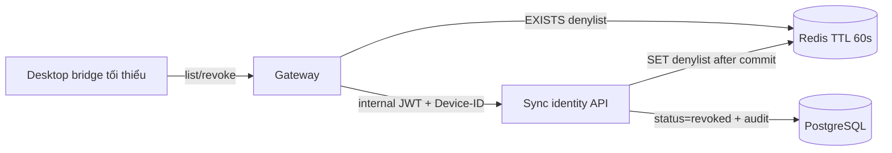

# BE Phase B — Device Revoke Design

**Date:** 2026-08-11  
**Status:** Approved design (not yet implemented)  
**Scope:** Self-service device list + revoke API, Redis edge denylist (TTL 60s),
Gateway early reject, desktop bridge/syncclient tối thiểu, cập nhật G4.  
**Repos liệu:**

- Backend: `/Users/syuro/Workspace/PERSONAL/dev-kit/dev-kit-backend`
- Desktop: `/Users/syuro/Workspace/PERSONAL/dev-kit/dev-kit-app`
- Docs: `/Users/syuro/Workspace/PERSONAL/dev-kit/base-doc`

**Follow-ups (out of this slice):** Device management UI polish, JetBrains
3-pane merge UI, Keycloak session logout, rename/reactivate device, distributed
rate limit, retention/backup engine, multi-region, internal JWT `jti` claim.

## Goal

Hoàn thiện tính năng revoke device end-to-end với bảo mật fail-closed ở sync
boundary: durable revoke trong PostgreSQL, cửa sổ edge ~1 phút qua Redis denylist
đọc bởi Gateway, client tối thiểu gọi được list/revoke (không polish UI).

## Decisions (locked)

| Topic | Choice |
|---|---|
| Product slice | Complete revoke feature (not full Phase B laundry list) |
| Keycloak logout on revoke | No — sync DB + edge denylist only |
| Edge denylist | Redis by **device**, TTL **60s**; BE writes, Gateway reads |
| Why not JWT `jti` denylist | Internal JWT is minted per request and has no `jti` today; blacklisting one `jti` does not stop the next request |
| Last ACTIVE device | Cannot revoke — HTTP `409` |
| Self-revoke | Allowed if another ACTIVE device remains |
| Desktop | Bridge + syncclient tối thiểu; G4 uses API instead of SQL |
| Redis down | Gateway **fail-open** to backend (PG still enforces); log warning |
| Redis key identity | Keycloak/JWT `sub` + deviceId (Gateway has no internal account UUID) |

## Current baseline (Phase A)

- Enrollment + session bootstrap; push/pull re-check device ACTIVE.
- `devices.status` ∈ `{active, revoked}`; revoked → `403`; no HTTP revoke/list.
- Operational revoke today: direct SQL (e.g. G4 / SyncApiIT).
- Gateway mints short-lived internal JWT (≤45s); forwards `X-DevKit-Device-ID`.
- Compose stack has no Redis yet.

## Architecture



**Two layers**

1. **Durable:** `devices.status = revoked` — session / push / pull / enrollment.
2. **Edge window:** Redis denylist TTL 60s — Gateway rejects before backend.

PostgreSQL remains the long-term source of truth. Redis is not on the
correctness path for arbitration; it only shortens the post-revoke edge window
while a stolen Keycloak access token may still be valid.

## API contract

Auth headers (same as sync today): Gateway-replaced `Authorization` (internal
JWT), `X-DevKit-Device-ID`, `X-DevKit-Sync-Protocol: 1`. Caller must be an
`ACTIVE` device for the account resolved from JWT `sub`.

### `GET /v1/sync/devices`

Returns devices for the authenticated account only.

```json
{
  "devices": [
    {
      "deviceId": "...",
      "status": "active|revoked",
      "createdAt": "...",
      "lastSeenAt": "...",
      "current": true
    }
  ]
}
```

- `current: true` when `deviceId` equals the caller header.
- No cross-account leakage.

### `POST /v1/sync/devices/{deviceId}/revoke`

| Case | HTTP |
|---|---|
| Unauthenticated / bad protocol | `401` |
| Caller not ACTIVE / revoked | `403` |
| Target missing / other account | `404` |
| Target is last ACTIVE device | `409` |
| Target already revoked | `200` (idempotent no-op; may refresh denylist TTL) |
| Success | `200` |

**Success side effects (order):**

1. Transaction: set target `status = revoked`; delete pending
   `device_enrollments` created by that device (`created_by_device_id`).
2. Audit `device.revoked` with `accountId`, `actorDeviceId`, `targetDeviceId`,
   `requestId` (never log tokens).
3. After commit: Redis `SET sync:revoked-device:{sub}:{deviceId} 1 EX 60`
   where `{sub}` is the Keycloak subject string for the account.

No rename, no reactivate in this slice.

## Redis & Gateway

### Redis

- Add Redis to private Compose network (new dependency for local/deployed stack).
- Key: `sync:revoked-device:{sub}:{deviceId}`
- Value: `1` (or revoke epoch seconds)
- TTL: **60 seconds**
- Writer: sync API after successful PG commit
- Reader: Gateway only

### Gateway filter

On `/v1/sync/**` after Keycloak auth:

1. Read JWT `sub`.
2. Read `X-DevKit-Device-ID` (already forwarded; not a reserved stripped header).
3. If Redis `EXISTS` key → respond `403`, do not mint/relay.
4. If Redis unavailable → **fail-open**, continue existing path, warn in logs.

No change required to internal JWT claims for this slice (`jti` / device claim
optional later).

## Desktop surface

Repos: `dev-kit-app`

- `internal/syncclient` (or transport): HTTP list + revoke.
- Bridge: `SyncListDevices` / `SyncRevokeDevice`, capability-gated like existing
  sync methods.
- No polished device-management UI in this slice.
- Self-revoke success → clear local session (same class of behavior as G4
  expired/revoked handling).
- `cmd/synce2e` G4: revoke via API instead of `psql` UPDATE.

## Testing

- Backend IT: list isolation, revoke success, last-active `409`, idempotent
  revoke, enrollment cleanup, Redis key set after commit.
- Gateway IT: denylisted device → `403`; Redis down → request still reaches
  backend path (fail-open).
- Deployed/matrix: G4 revoke through API; revoked device rejected on sync.

## Documentation updates (same change set)

- This spec under `base-doc/docs/superpowers/specs/`.
- Companion backend spec under `dev-kit-backend/docs/specs/`.
- Product docs: `/dev-kit/saas-backend`, `/dev-kit/roadmap`,
  `/dev-kit/implementation-status` (and security-controls remaining notes).

## Out of scope

- Device management UI / JetBrains 3-pane merge polish
- Keycloak Admin logout / global SSO revoke
- Rename / reactivate
- Distributed rate limiting as correctness
- Retention/backup engine, multi-region
- Internal JWT `jti` denylist

## Done when

1. List + revoke API with last-ACTIVE guard, audit, enrollment cleanup.
2. Redis denylist TTL 60s; Gateway enforce; Redis down fail-open.
3. Desktop bridge/syncclient tối thiểu; G4 uses API.
4. Docs above updated to match this design.
